<link rel="stylesheet" type="text/css" href="style.css">

### ISTQB TEST MANAGEMENT CERTIFACATE V3

<u>**TEST PROCESS**</u>
- [<b>TEST PROCESS:</b><ul><li>TEST PLANNING: **V KOMPETENCI TEST MANAGERA**</li><li>TEST MONITORING A CONTROLING: **V KOMPETENCI TEST MANAGERA**</li><li>TEST ANALYSIS</li><li>TEST DESIGN</li><li>TEST IMPLEMENTATION</li><li>TEST EXECUTION</li><li>TEST COMPLETATION: **V KOMPETENCI TEST MANAGERA**</li></ul>](#test-process)

<u>**CONTEXT OF TESTING**</u>
- [<b>CONTEXT OF TESTING:</b><ul><li>STAKEHOLDERS</li><li>JAK DŮLEŽITÉ JE ZNALOST STAKEHOLDERS V TEST MANAGEMENTU</li><li>TEST MANAGEMENT V HYBRIDNÍM SOFTWARE DEVELOPMENT MODELU</li><li>TEST MANAGEMENT AKTIVITY V PRO RŮZNÉ SDLC MODELY</li><li>TEST MANAGEMENT AKTIVITY V PRO RŮZNÉ ŮROVNĚ TESTŮ</li><li>TEST MANAGEMENT AKTIVITY V PRO RŮZNÉ TYPY TESTOVÁNÍ</li><li>TEST MANAGEMENT AKTIVITY VZHLEDEM k TEST PLÁNU, TEST MONITORINGU A KONTROLE</li><li>OTÁZKY</li></ul>](#test-context)

<u>**RISK BASED TESTING**</u>
- [<b>RISK-BASED TESTING</b><ul><li>INTRO DO RISK-BASED TESTINGU</li><li>IDENTIFIKACE ÚROVNĚ DOPADU RIZIKA</li><li>OHODNOCENÍ ÚROVNĚ DOPADU RIZIKA</li><li>ZMÍRNĚNÍ RIZIK POMOCÍ TESTINGU</li><li>TECHNIKY PRO RISK-BASED TESTING: DEPTH-FIRST, BREADTH-FIRST</li><li>TECHNIKY PRO RISK-BASED TESTING</li><li>ÚSPĚŠNÉ METRIKY A OBTÍŽNOSTI SPOJENÉ S RISK-BASED TECHNIKAMI</li><li>OTÁZKY K RISK BASED TESTING</li></ul>](#risk-based-testing)

<u>**PROJEKT TEST STRATEGY**</u>
- [<b>PROJEKT TEST STRATEGY:</b><ul><li>INTRO</li><li>PŘÍSTUP K TESTOVÁNÍ (TEST APPROACH)</li><li>ANALÝZA ORGANIZATION TEST STRATEGY</li><li>DEFINICE TEST OBJECTIVES</li><li>OTÁZKY K TEST STRATEGY</li></ul>](#test-strategy)

<u>**VYLEPŠENÍ TESTOVACÍHO PROCESU**</u>
- [<b>ZLEPŠOVÁNÍ TESTOVACÍHO PROCESU:</b>](#improve-test-process)

<u>**TESTOVACÍ NÁSTROJE**</u>
- [<b>ZLEPŠOVÁNÍ TESTOVACÍHO PROCESU:</b><ul><li>ZAVEDENÍ NOVÉHO NÁSTROJE</li><li>TECHNICKÉ A BUSINESS ASPEKTY, KTERÉ MAJÍ VLIV NA ROZHODNUTÍ O ZAVEDNÍ NOVÉHO NÁSTROJE</li><li>NÁVRATNOST INVESTICE (ROI)</li><li>ŽIVOTNÍ CYKLUS NÁSTROJE</li><li>OTÁZKY K TEST TOOLS</li></ul>](#test-tools)

<u>**TEST METRIKY**</u>
- [<b>TEST METRIKY:</b><ul><li>METRIKY PRO TEST MANAGEMENT</li><li>TEST REPORTING</li><li>OTÁZKY K TEST METRIKÁM</li></ul>](#metriky)

<u>**ODHADY NA TESTOVÁNÍ**</u>
- [<b>ODHADY NA TESTOVÁNÍ:</b><ul><li>FAKTORY OVLIVŇUJÍCÍ ODHADY TESTOVÁNÍ</li><li>ODHADOVACÍ TECHNIKY</li><li>EXTRAPOLACE</li><li>WIDEBAND DELPHI</li><li>3-BODOVÝ ODHAD</li><li>VÝBĚR TECHNIKY PRO ODHAD</li><li>OTÁZKY</li></ul>](#odhady)

***

### <span style="color:Indigo">**POZNÁMKY**</span>
- ❗ **stupně testování**
  - [x] ***component testing*** -> ***integration testing*** -> ***system testing*** -> ***akceptance testing***
- ✅ **druhy testování**
  - [x] functional testing
    - [x] nonfunctional testing
      - [x] structure testing
        - [x] change related testing
- 🔵 **management testovacího procesu**
  - [x] planning test process
  - [x] monitoring / controlling test process
  - [x] test analysis
  - [x] test design
  - [x] test implementation (př. příprava testovacího prostředí)
  - [x] test execution
  - [x] test completation
- ✳️ **možný posun na pozicích v testingu**
  - <u>příklad</u>: Security Tester se může posunout na Test Analyst nebo Test Manager a ten se dále může posunout až na Managing The Test Team nebo Assessing Test Processes

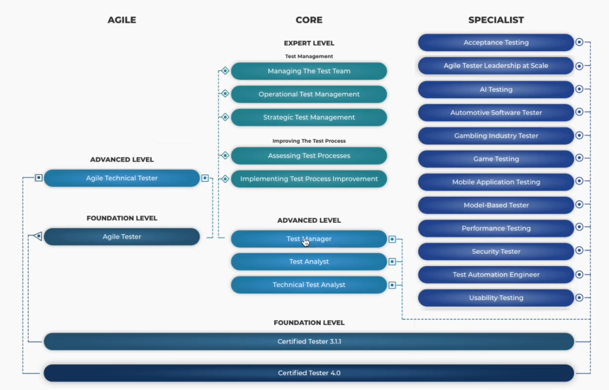

- ❗ **struktura test managementu**

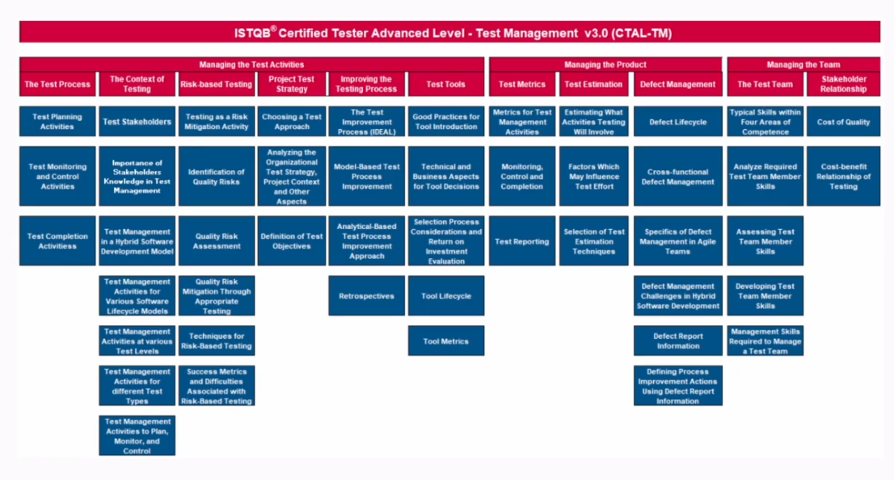

- ✅ **DOD** = Definition Of Done

<hr style="height:1px;border-top:1px solid #f00" />

##### test process
### TEST PROCESS:
#### <ul><li>TEST PLANNING: **V KOMPETENCI TEST MANAGERA**</li><li>TEST MONITORING A CONTROLING: **V KOMPETENCI TEST MANAGERA**</li><li>TEST ANALYSIS</li><li>TEST DESIGN</li><li>TEST IMPLEMENTATION</li><li>TEST EXECUTION</li><li>TEST COMPLETATION: **V KOMPETENCI TEST MANAGERA**</li></ul>

<u>TEST PLANNING: **V KOMPETENCI TEST MANAGERA**</u>
- <span style="color:DeepPink">**plánujeme testivací aktivity a vytváříme testovací plán**</span>.
- start je většinou na začátku projektu nebo konci sprintu v agile = **ZAHÁJENÍ JE HNED POTÉ, CO ZNÁME POŽADAVKY**.
  - 🔵 [ ] kdo bude co testovat?
  - 🔵 [ ] jaký je celkový budget na testování?
  - 🔵 [ ] nastavení scope testování.
- ✅ identifikujeme aktivity a zdroje definované v test policy.
  - ❗ pokud se změní zdroje (př. je jich potřeba více), pak se musí změnit i test plán = **JE TO KONTINUÁLNÍ AKTIVITA**.
  - ***test policy stojí v hierarchii ještě výše než test planning.***
  - **test policy je malý dokument, který říká, jak se provádí testování na všech projektech ne pouze specifického projektu.**
- ✅ **5 hlavních aktivit prováděných v test planiningu**
  - 🔵 <u>porozumění kontextu testovaného objektu</u>: př. jaká bude test strategy?, jaký bude scope testování?, jaké položky se budou testovat?, jaký je časový plán testování?
  - 🔵 <u>identifikace a analýza produktových rizik</u>:
    - produktová rizika se vztahují k kvalitě produktu nebo aplikace.
    - musíme je identifikovat a následně analyzovat = **POUŽÍVÁME TECHNIKU RISK BASED TESTING**
  - 🔵 <u>risk treatment activity</u>:
    - na základě risk analýzi se zaznamenají rizika a opatření k jejich eliminaci.
    - případně se stanoví preventivní opatření.
  - 🔵 <u>definování přístupu k tetování a stanovení si potřebných zdrojů k testování (lidi, testovací nástroje, potřebné prostředí).</u>:
  - 🔵 <u>stanovení testovacího plánu.</u>:
    - v této fázi by měl být odsouhlasen všemi stakeholders.

<u>TEST MONITORING A CONTROLING: **V KOMPETENCI TEST MANAGERA**</u>
- monitoring je porovnání toho, <span style="color:DeepPink">**co máme v testovacím plánu a co již bylo skutečně uděláno**</span> = **JE TO KONTINUÁLNÍ AKTIVITA**.
  - 🔵 pro monitorování nějaké veličiny si vytváříme "vlastní framework pro momitorování"
  - 🔵 monitorujeme **například počet defektů na projektu** nebo **počet napsaných testovacích scénářů** = **NAPŘ. VYTVOŘENÍ STRUCTURE V JIRA**.
- controling je **korekce toho, co jsme zjistili při monitoringu**.
- patří sem reportování výsledků z testovacího procesu.

<u>TEST ANALYSIS</u>
- jedná se o analýzu produktu (jeho designu, požadavků na produktu, wireframes, user stories) + **příprava testovacích podmínek pro testovací scénáře**.
  - 🔵 **"CO BUDEME TESTOVAT?"** - př. bude se testovat validní přihlášení.

<u>TEST DESIGN</u>
- příprava samostatných testovacích scénářů.
  - 🔵 **"JAK BUDEME TESTOVAT?"** - př. jaká data použijeme pro testování validního přihlášení, kdo to bude testovat, na jakém prostředí?

<u>TEST IMPLEMENTATION</u>
- př. nastavíme prioritu našim testovacím případům, přiřadíme je do test suite, vytvoříme testovací prostředí
  - **provádí test analytik (TA) z businness pohledu.**

<u>TEST EXECUTION</u>
- exekuujeme naše testovací případy a případně zadáváme chyby.
  - **provádí technický test analytik (TTA) z technicého pohledu.**

<u>TEST COMPLETATION: **V KOMPETENCI TEST MANAGERA**</u>
- sem patří uložení a archivace testů, vyhodnocení testovacího procesu + návrhy na zlepšení.
- provádí se nejen na konci projektu, ale také pokud dosáhneme nějakého milníku nebo je vydán nový release.
- pokud máme nějaké nevyřešené defekty z minulé iterace nebo minulého release, které mají být vyřešeny v příští iteraci, <span style="color:DeepPink">**zakládáme CHANGE REQUEST nebo ho přidáme do BACKLOGU.**</span>
- ✅ **5 hlavních aktivit prováděných v test completation**
  - 🔵 <u>vytvoření a schválení completation reportu</u>:
    - report ujišťuje, že byly provedeny všechny testy a splněny všechny cíle testování.
    - report používá relevantní informace z test plánu, defekt reportu, test results, test progress reportu = **provede se sumarizace těchto informací** -> **vzniká completation report**.
  - 🔵 <u>archivace testware</u>:
    - archivujeme věci, které by mohli být **užitečné v budoucnosti**, nebo které se budou **opakovaně používat**.
    - typicky archivujeme testovací případy pro opakované použití.
      - **dále archivujeme**: test logs, test reporty, test results
  - 🔵 <u>předávání testware</u>:
      - předáváme typicky věci (řešení nějakých defektů, nastavení testovacích nástrojů), které můžeme v budoucnu využít = *WIKI STRÁNKA S SDÍLENÝMI ZNALOSTMI**.
  - 🔵 <u>uvedení testovacího prostředí do počátečního stavu před testováním</u>:
      - př. smazání testovacích dat, logů, skriptů, driverů, specifického nastavení, uživatelů, kteří nejsou užiteční pro další testování: ***PI1 -> PI2 - PI3 iterace na NNL***.
  - 🔵 <u>retrospekce</u>:
    - vzít si ponaučení z projektu (co se povedlo a co se naopak nepovedlo).
    - zdokumentovat, co se lid na projektu během fáze testování naučili od kodování až po řešení nějaký specifických požadavků.

<hr style="height:1px;border-top:1px solid #f00" />

##### test context
### CONTEXT OF TESTING:
#### <ul><li>STAKEHOLDERS</li><li>JAK DŮLEŽITÉ JE ZNALOST STAKEHOLDERS V TEST MANAGEMENTU</li><li>TEST MANAGEMENT V HYBRIDNÍM SOFTWARE DEVELOPMENT MODELU</li><li>TEST MANAGEMENT AKTIVITY V PRO RŮZNÉ SDLC MODELY</li><li>TEST MANAGEMENT AKTIVITY V PRO RŮZNÉ ŮROVNĚ TESTŮ</li><li>TEST MANAGEMENT AKTIVITY V PRO RŮZNÉ TYPY TESTOVÁNÍ</li><li>TEST MANAGEMENT AKTIVITY VZHLEDEM k TEST PLÁNU, TEST MONITORINGU A KONTROLE</li><li>OTÁZKY</li></ul>
- **úloha TM není**:
  - <span style="color:DarkKhaki">**zavést novou testovací techniku**</span> (jsou již jasně dané).
- **úloha TM je**:
  - <span style="color:DarkKhaki">**vybrat existující testovací techniku + vytvořit testovací strategii pro projekt**</span>.
  - **vytvořit a zavést test plán** na projektu.

<u>STAKEHOLDERS</u>
- stakeholders jsou jednotlivci nebo skupiny, které mají **přímý nebo nepřímý zájem na kvalitě produktu**.
- ✳️ **máme 5 hlavních typů stakeholderů**
  - 🔸**vývojáři, vedoucí a mangeři týmu vývojářů**: provádějí např. **UNIT TESTOVÁNÍ**, dostávájí feedback od testerů.
  - 🔸**testeři, test manageři, vedoucí týmu testerů**: připravují testovací plány, provádějí test exekuci, reportují, automatizují testování.
  - 🔸**z business pohledu jsou to -> projekt manageři, business uživatelé, product owners**: 
    - definují požadovanou úroveň kvality produktu.
    - definují požadavky na projectu.
    - doporučují požadované pokrytí v závislosti na rizicích.
    - **spolupracují s UAT testery** a rozhodují dále co s produkem na základě výsledků testů.
      - akceptační testování je testování z pohledu zákazníka.
  - 🔸**operační tým**: <span style="color:DarkKhaki">**součástí akceptačního testování je i operační akceptační testování.**</span>
    - operační akceptační testování se zaměřuje na **NEFUNKCIONÁLNÍ TESTOVÁNÍ** z pohledu zákazníka př. kolik loads / čas loads dokumentu je potřeba dodržet.
    - **jedná se o PERFORMANCE TESTY z pohledu zákazníka.**
  - 🔸**uživatelé a zákazníci**: ❗ **rozdíl mezi nimi**: zákazník produkt kupuje, ale uživatel ho přímo používá.
    - ❗ zákazníci provádějí **VALIDACI PRODUKTU** = neprovádějí verifikaci produktu.

<u>JAK DŮLEŽITÉ JE ZNALOST STAKEHOLDERS V TEST MANAGEMENTU</u>
- existuje tzv. <span style="color:DarkKhaki">**stakeholders power/interest matrix, která nám říká, kdo má mít znalost z jaké oblasti.**</span>
  - na základě matice si vybírám stakeholdera, který má mít informace, které momentálně potřebuji.

**příklad stakholders power/interest matice**
- vyvíjíme aplikaci pro fotbalý tým
  - někteří stakeholders mají low power a high interrest na aplikaci = **fanoušci klubu** (mají velký zájem o fotbalovou aplikaci, ale malý vliv na to jaká bude).
  - někteří stakeholders mají high power a low interrest na aplikaci = **investoři / vláda** (mají velký vliv na podobu aplikace, ale na druhé straně fotbalová aplikace resp. fotbal je moc nezajímá )

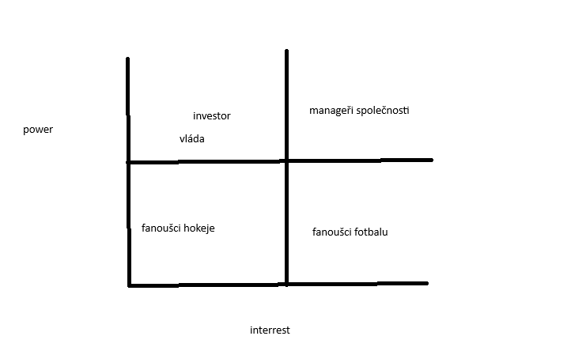

<thousandHundredPx>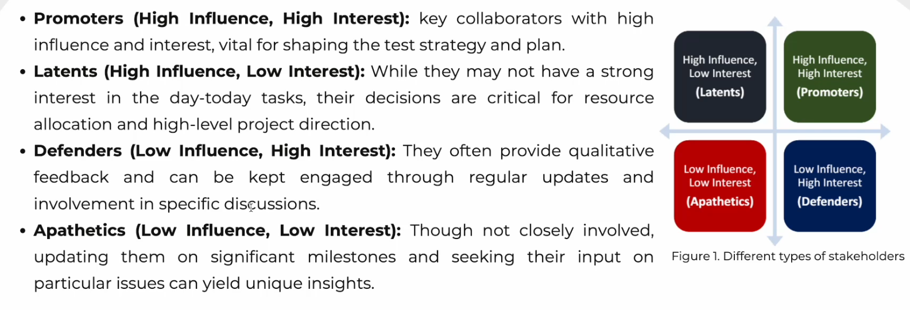</thousandHundredPx>

<u>TEST MANAGEMENT V HYBRIDNÍM SOFTWARE DEVELOPMENT MODELU</u>
- hybridní model **kombinuje přístupy v tradičním sekvenčním přístupu (waterfall model) a agilním přístupu**.
  - každý z modelů má svoje výhody i nevýhody.

**2 hlavní důvody použití hybridního modelu**
- 🔵 [x] chceme se přesunout z sekvenčního způsobu řízení do agilního způsobu řízení <span style="color:DarkKhaki">**-> na konci je agilní model řízení.**</span>
- 🔵 [x] potřebujeme přímo použít hybridní model <span style="color:DarkKhaki">**(používáme některé věci z sekvenčního modelu a některé věci z agilního modelu).**</span>
  - sekvenční model používáme např. v případě, že máme **"vysoce rizikový projekt"**.
- <span style="color:DarkKhaki">**pokud používáme hybridní model měly bychom:**</span>
  - ***znát silné/slabé stránky obou přístupů.***
  - ujistit se, že tým je ***schopen používat agilní techniky nebo jejich mix s sekvenčním přístupem.***
  - připravit test team na ***spolupráci s stakeholders v agilním přístupu.***

<u>TEST MANAGEMENT AKTIVITY V PRO RŮZNÉ SDLC MODELY</u>

**porovnání test management aktivit v sekvenčním/iterativním modelu**
- ✳️ **Estimation = odhady**: v sekvenčním přístupu je odhad na začátku, v agilním přístupu je iterativní pro každou story.
- ✳️ **Testware**: v agilním přístupu jsou často akceptační kriteria náhrada za testy + je zde minimum dokumentace.
- ✳️ **Roles**: v sekvenčním přístup jsou jasně dané, v agilním přístupu je to často mix (1 člověk má více rolí).
- ✳️ **Testing aproach**: v agilním přístupu zkoušíme různé přístupy - pokud jeden nevyhovuje, zkusíme jiný.
- ✳️ **Metrics**: v agilním přístupu máme "Velocity Team", který měří efektivitu teamu v jednotlivých iteracích na projektu.

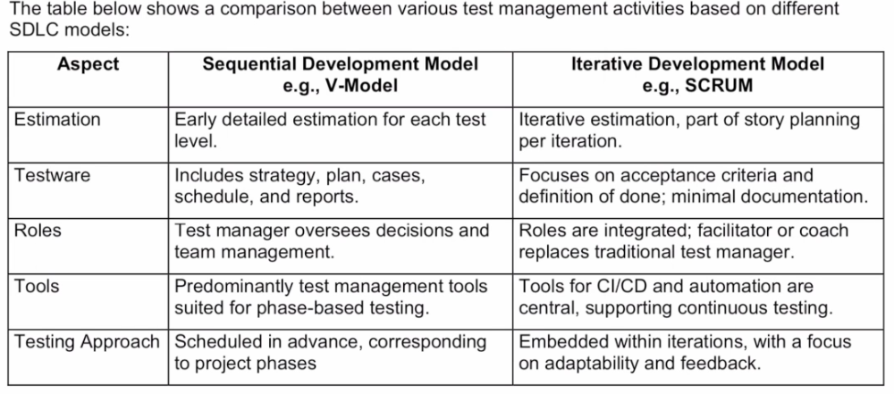

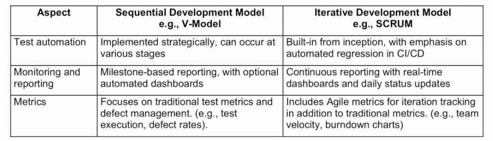

<u>TEST MANAGEMENT AKTIVITY V PRO RŮZNÉ ŮROVNĚ TESTŮ</u>
- ❗ **důležitá poznámka**: systémově-integrační testování by mělo předcházet systémovému testování.
- ✅ **Component testing (UNIT TESTING) a Component integration testing**: 
  - ***vyžaduje spolupráci s vývojáři.***
  - není odpovědností testera ani test managera
    - v některých společnostech **je odpovědní vývojářů resp.** jejich vedoucího, což není vedoucí vývojářů, ale **TEST LEADER**.
  - dokud není hotové, tak se nemůže přejít na system testing level.
  - **příklady používaných technik**:
    - condition coverage
    - statement coverage
    - branch coverage
  - <span style="color:DarkKhaki">**některé věci mohou být svěřeny testerům, pokud mají zkušenosti s daným prog. jazykem**</span>: př. **CODE REVIEWS**
    - testeři totiž mají analytické schopnosti a celkově schopnosti, kterými mohou přispět k Code Review.
  - příklady používaných technik v systémově-integračním testování komponent:
    - TOP -> DOWN, BOTTOM -> UP
    - BIG BANG (nedoporučuje se používat) 
- ✅ **System integration testing**: 
  - měl by být sladěn s provedenou risk analýzou
- ✅ **System testing**:
  - v sekkvenčím přístupu se provádí v rámci SDLC modelu.
  - v agilním přístupu se provádí v rámci testování user stories (NNL projekt).
- ✅ **Akceptance testing**:
  - ***vyžaduje spolupráci s stakeholders pro potvrzení si akceptačních kriterií a provedení review test plánu.***
  - <span style="color:DarkKhaki">**často UAT testování**</span> **NEPROVÁDÍ TESTEŘI** = mluvíme o samotném testování, ne o přípravě testovacích scénářů.

<u>TEST MANAGEMENT AKTIVITY V PRO RŮZNÉ TYPY TESTOVÁNÍ</u>
- v **funčním testování** odpovídáme za to, že všechny **funkcionality v projektu pracují správně**.
- v **nefunčním testování** provádíme **VERIFIKACI** systému např. security testing, performace testing.
- 🔵 **Funkcional Test Management**:
  - ***měli by jsme mít:***
    - [ ] testovací strategii jak otestovat všechny funkční požadavky na systém.
    - [ ] nástroj(postup, cokoli) jak monitorovat progress v testování funkčních požadavků.
    - [ ] ❗ **jak testovací strategie tak nástroje by měly být součástí test plánu.**
  - **!!** důležitá je alokace zdrojů pro testování **!! ->** protože funční testování typicky <u>ZABERE VELMI MNOHO ČASU</u>.
- 🔵 **Non-Funkcional Test Management**:
  - př. potřebuji na systému vytvořit 10 000 smluv za nějaký čas.
  - často je to upozadněný aspekt testování.
  - příkladem je např. security testing, ability testing,
- 🔵 **Black Box Testing Management**:
  - <span style="color:DarkKhaki">**je to testování zaměřené na uživatele systému**</span> = **jsou pokryty všechny možné uživatelské scénáře + požadavky businessu**.
    - proto se v black box testování se stanovují **COVERAGE KRITERIA** např. v Boundary Analýze jsou to 2 hraniční hodnoty atd.
  - + v black box se navíc testuje integrace s externími systémy pomocí **testování API rozhraní**
- 🔵 **White Box Testing Management**:
  - soustředíme se na optimalizaci pokrytí kodu a k tomu používáme na to specializovan nástroje **nebo přímo AI**.
  - ❗ přestože white box testing **neposkytuje business výstup, tak musíme zajistit, že napsaný kod splňuje business požadavky** resp. pokrývá různé možné scénáře, keré mohou nastat.

<u>TEST MANAGEMENT AKTIVITY VZHLEDEM k TEST PLÁNU, TEST MONITORINGU A KONTROLE</u>

**test planning** 
- test plánování by mělo kompletně pokrývat scope = **test plán by měl být komplexní a zahrnovat jak funkcionální, tak nefunkcionální požadavky**.
  - test plán by měl obsahovat jaké techniky použít pro otestování funcionálních i nefunkcionálních požadavků a pokrytí scope.
- test plánování by mělo obsahovat aktivitu posouzení rizik na projektu = **vytvoření test analýzy**
  - <span style="color:DarkKhaki">**mnoho TM nezahrnuje risk analýzu do test plánování, protože je považují za méně významnou než např. vytvoření TC nebo napsání požadavků.**</span>
- test plánování by mělo obsahovat i aktivtu **plánování zdrojů**.
  - ❔ **kdo je za co zodpovědný?**
  - ❔ **jaká je struktura týmu?**
  - ❔ **kdo bude jak/jakým kanálem s kým komunikovat?**

**test monitoring**
- obsahuje porovnání současného stavu exekuce testů proti očekávanému plánu = **splňujeme pláne nebo nesplňujeme?**
- obsahuje správu veškerých vzniklých defektů.
- stanovení jaké testovací případy jsou prioritní?
- obsahuje činosti, která dohlížejí nad efektivností použitých testovacích nástrojů a jejich případou výměnu, pokud nejsou již efektivní.
- obsahuje úzkou spolupráci s vývojovým týmem.

**test control**
- oobsahuje aktivity k zlepšení testovacího procesu na základě výzev, vývoje na projektu.
- TM by měl mít **QUALITY GATE MANAGEMENT** = věc podobná napsaným **EXIT CRITERIIM**.
  - exit kriteria obsahují cíle, které musíme dosáhnout, aby jsme mohli říci, že je hotovo/dotestováno/splněno resp. DOD (Definition Of Done)
- quality gate je virtuální brána, která je otevřená pouze v případě, že splněna nějaká kriteria kvality.

<u>OTÁZKY</u>
- ❔ **jaká skupina stakeholders je pro mě důležitá, pokud mám detailní otázky k projektu?**:
  - high level stakeholders jsou nejlepší volba pro detailní otázky.
    - pokud <span style="color:DarkRed">**chci odpověď na detailní otázky z projektu**</span> v mailu, zahrnu vždy pouze high level stakeholders.
    - high level stakeholder je <span style="color:DarkRed">**někdo s managerskou rolí**</span> (není to např. automatizační tester nebo security architekt = technická role)
    - **správná odpověď je C**: <u>Test Environement Managers (můžou nám pomoci s plánováním na projektu) + application owners = **VŠICHNI MAJÍ PŘÍMÝ VLIV NA PROJEKT A JEHO VÝSTUPY**.</u>
  - low level stakeholders jsou nejlepší volba pro plánování workshopu.

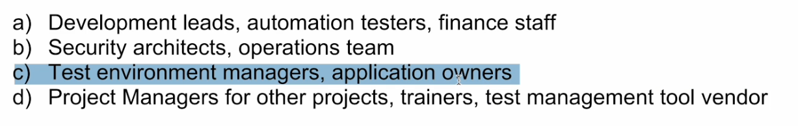

- ❔ **jako test manager odpovědný za AKC testování zařídím nákup nového test management toolu.**
  - ❔ **Jaká skupina stakeholders bude mít high interest a high influence na AKC testování a tento management tool**:
- **správná odpověď je A**: <u>Testers</u>

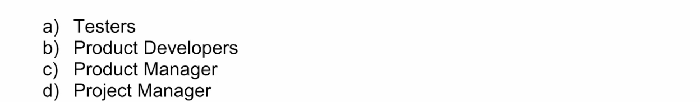

- ❔ **projekt přešel do agilního způsobu řízení, ale test tým s tím nemám zkušenost (má zkušenost pouze z sekvenčního přístupu). Jaké aktivity jako test manager provedu NEJDŘÍVE?**
- **správná odpověď je A**: <u>Coaching a mentoring týmu na automatizaci, CI, testing a delivery = **VŠECHNO TO JSOU AKTIVITY Z AGILNÍHO ZPŮSOBU ŘÍZENÍ**</u>
    - **co provedeme jako první je seznámení týmu s agilním způsobem řízení**

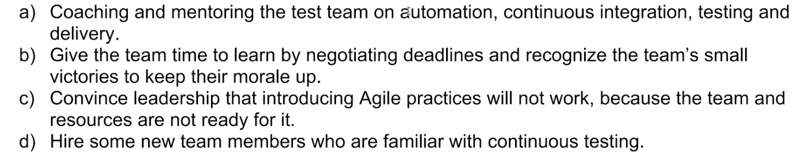

- ❔ **Jako TM přijdu do nové organizace a mám za úkol identifikovat aktuálně používaný lifecycle model - zjistím 4 skuečnosti.**
  - ❔ **O jaký model se jedná?**
- mohu se zeptat členů týmu, ale každý může mít jinou představu o tom, v jakém modelu funguje.
- **správná odpověď je C**: <u>Hybridní model, protože jedno z zjištění je podmínka ukončení jedné fáze, před začátkem další fáze.</u>

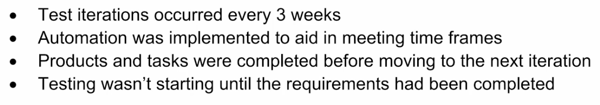

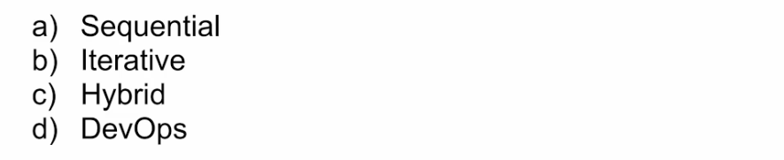

- ❔ **Pracujeme pro start-up a máme releasy každý měsíc. Které test management aktivity aplikuji?**
- **odpověď A**: DevOps tool není test management aktivita - NOK.
- **odpověď B**: protože se jedná o iterativní lifecycle, tak budeme posílat test report spíše automatizovaně než manuálně - NOK. 
- **odpověď C**: stejně jako B - provádíme automatizovaně - NOK.
- **správná odpověď je D**: <u>Je to test management aktivita s vysokou přidanou hodnotou v lifecycle = **DŮLEŽITOST BEZCHYBNÉ KOMUNIKACE V TÝMU**</u>

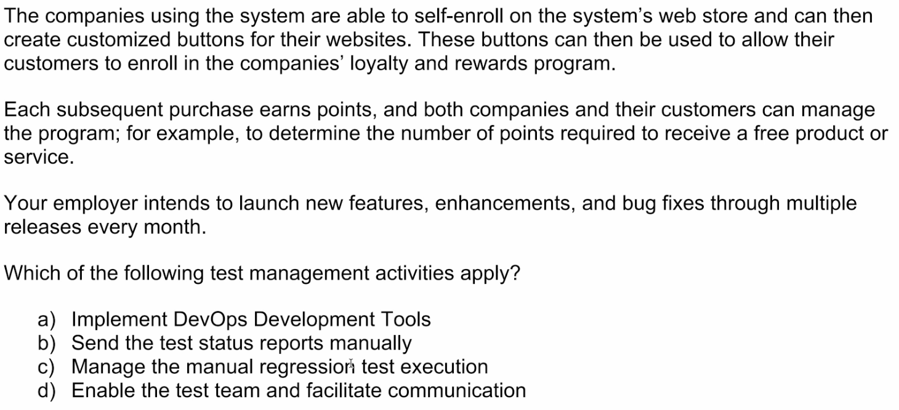

- ❔ **Pracujeme na agilním projektu pro zdravotnictví s 2-týdeními sprinty. Důraz je kladen na bezpečnost a dodržování norem. Používá se CI/CD, cloud, automatizace, časté regresní testy a risk management**
  - **Která z test management aktivit nejvíce zdůrazňuje specifické zaměření projektu?**
- **odpověď A**: risk management plán je prováděn na začátku projektu - NOK.
- **odpověď B**: jsme v maitenance fázi, takže tato odpověď je totálně špatná - NOK.
- **odpověď C**: jsme v maitenance fázi, takže tato odpověď je totálně špatná - NOK.
- **správná odpověď je D**: <u>Aplikace je  již vyvinutá, jsme v maintanance fázi a potřebujeme další rozvoj regresních testů.</u>

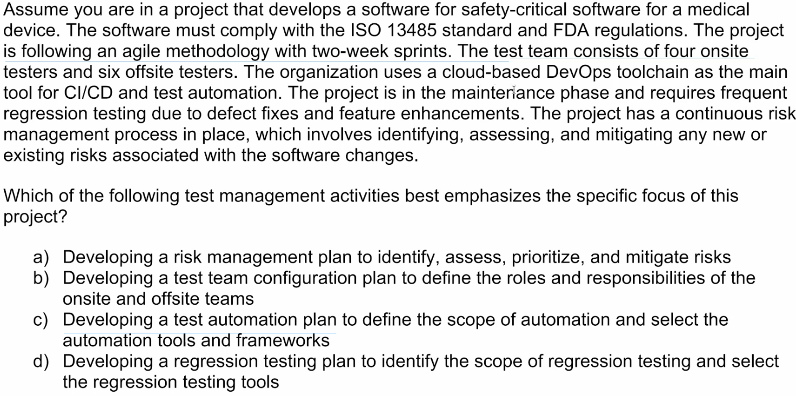

- ❔ **V stakeholders kvadrant matici je jaký kvadrant považovaný za "Low Influence, High Interrest"?**
- **správná odpověď je D**: <u>Defenders</u>

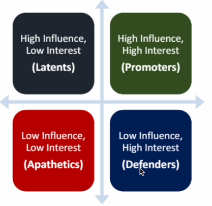

- ❔ **Jaký je rozdíl v použítí dashboardů mezi V-modelem a Scrum modelem?**
- dashboards používáme v projektech = **odpověď D je určitě špatně**.
  - v V-modelu dashboard mít můžeme, ale také nemusíme (záleží projekt od projektu).
- <u>co je důležité, že v Scram projektu dashboard musíme mít = **odpověď B je určitě špatně**.</u>
  - potřebujeme visuální reprezentaci úkolů na projektu a progresu na projektu.


- ❔ **Na jakém test level je odpovědnost sdílena mezi test management team a development team?**
- odpověď na tuto otázku je podobná odpovědi na otázku:. v jakém test level je development tým zapojen nejvíce?
  - developmnet je zapojen v unit testech, integračních testech a component testech.
- **odpovědi B, C, D**: odpovědnost je čistě na testovacím týmu.
- **správná odpověď je A**: <u>Component-Integration testing</u>
  - protože většina testů je prováděna právě development týmem = **proto je zde sdílená odpovědnost**.

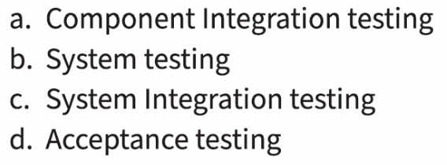

- ❔ **Hledám nový nástroj na accesibility testing. Jaký typ testování nám usnadní?**
- **správná odpověď je D**: <u>Non-Funkcional testing</u>

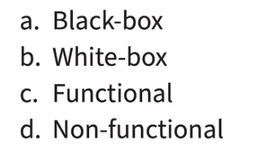

- ❔ **Co na základě popisu projektu urgentně potřebuji k prozkoumání a zhodnocení dopadu a rizik na testovací process?**
- máme zde celkem striktní proces (požadavky, schválení) = **půjde o sekvenční model + kritickou aplikaci**
- budeme vybírat odpověď, která zohledňuje nějakým způsobem riziko.
- **správná odpověď je D**: <u>Odpověď zohledňuje riziko, standarty, regulace na úrovni aplikací</u>
  - security plán, acceptance test, production implementation plan procedure je taky důležitý, ale ***ne nyní + ne pro testovací tým***.

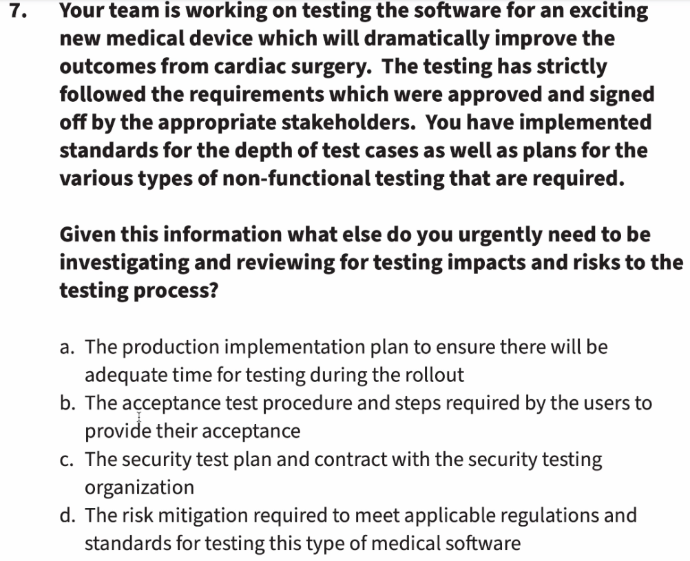

- ❔ **Co na základě popisu fungování na projektu musíme nyní učinit, aby se projekt pohnul dopředu?**
- **odpověď A**: není správná, protože společnost už se rozhodla, že chce offsite tým a chce jít cestou nového přístupu k testování.
- **odpověď B**: <u>je správná odpověď, protože projekt je v nepořádku a nejsou zde jasné testovací postupy = **jak sdílet informace a jak komunikovat s externím týmem**.</u>
- **odpověď C**: není správná, externí tým nepotřebuje test plán, onsite tým neví, co mám dělat = **problém je s interním týmem**.
- **odpověď D**: není správná, nepotřebujeme TM pro externí tým, protože již jednoho máme.

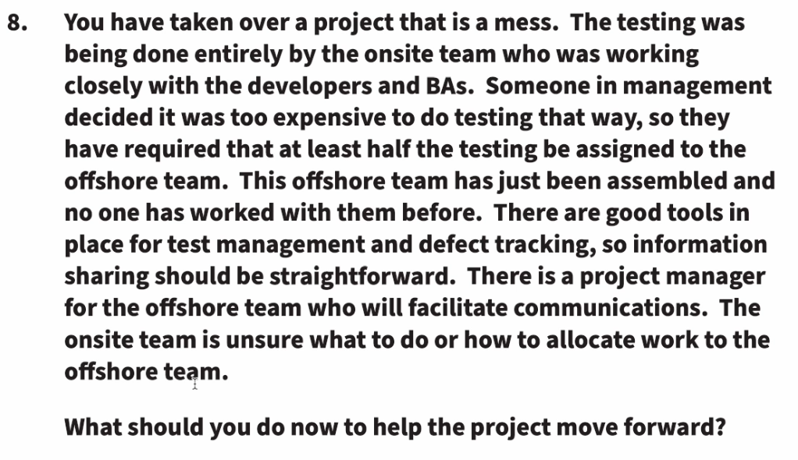

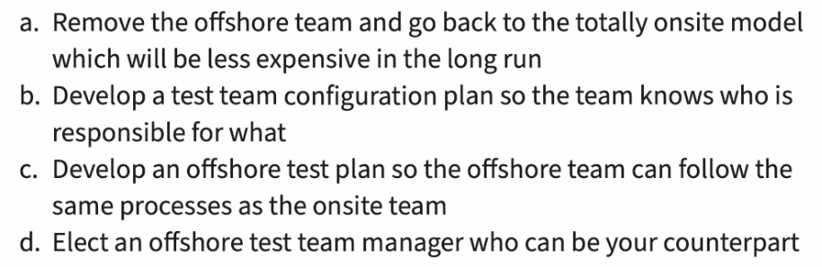

<hr style="height:1px;border-top:1px solid #f00" />

##### risk based testing
### RISK-BASED TESTING
#### <ul><li>INTRO DO RISK-BASED TESTINGU</li><li>IDENTIFIKACE ÚROVNĚ DOPADU RIZIKA</li><li>OHODNOCENÍ ÚROVNĚ DOPADU RIZIKA</li><li>ZMÍRNĚNÍ RIZIK POMOCÍ TESTINGU</li><li>TECHNIKY PRO RISK-BASED TESTING: DEPTH-FIRST, BREADTH-FIRST</li><li>TECHNIKY PRO RISK-BASED TESTING</li><li>ÚSPĚŠNÉ METRIKY A OBTÍŽNOSTI SPOJENÉ S RISK-BASED TECHNIKAMI</li><li>OTÁZKY K RISK BASED TESTING</li></ul>

<u>INTRO DO RISK-BASED TESTINGU</u>
- risk je obecně něco negativního v budoucnosti.
- risk má nějakou pravděpodobnost, že nastane.
- **v testingu máme 2 druhy risku**:
  - [x] ✳️ **projekt risk**
    - je vztažený k projekt managementu = **nepotřebuje testování**
  - [x] ✳️ **product risk** ***(na to se zaměříme)***
    - jedná se o risk, kdy můžeme mít nějaké defekty a selhání v aplikaci.
    - k jejich odhalení <span style="color:DarkMagenta">**potřebujeme aplikaci otestovat.**</span>
- máme **2 metody testování aplikací**:
  - **risk-based testing**
    - <u>testování se provádí na základě rizik.</u>
  - **requirements-based testing**
    - <u>testování v oblasti plánování, analýze a exekuci se provádí na základě požadavků.</u>
    - na základě požadavků píši test analýzu, vybírám testovací techniky pro testování, stanovuji např. pořadí spuštěných testů na základě rizik.

**risk-based testing 1**
- v risk-based testování **provádím specifické kroky**:
  - 🔵 **1. identifikace rizika**: identifikujeme rizika např. brainstormingem, pořádáním meetingu k odhalení rizik.
  - 🔵 **2. posouzení rizika**: posuzujeme ***PRAVDĚPODOBNOST***, že risk nastane v budoucnosti př. 10% pravděpodobnost a ***DOPAD(severitu)*** rizika npř. na uživatele nebo business.
    - <u>pravděpodobnost * dopad můžeme změřit 2 cestami.</u>
    - **kvantitativně**: použijeme konkrétní množství
      - je to např. konstanta vyjádřená číslem (1000 Kč).
      -  **příklad**: dopad rizika je 1000 Kč => pak `při pravděpodobnosti 90%(0.9)` je to `0.9*1000 = 900 Kč` => **risk rating je 900 Kč**.
        - <u>pokud nastane riziko s pravděpodobností 90% pak bude mít dopad (bude nás to stát) 1000 Kč.</u>
    - **kvalitativně**: zde nedokážeme vyjádřit pravděpodobnost * dopad číselně = může být vyjádřená pouze slovně (low, medium, high....).
      - výsledek je pak na stupnici od 1 (very low) do 5 (very high).
      -  na základě pak prioritizujeme / ohodnocujeme naše testovací případy.
-  často se na začátku projektu identifikují všechny rizika a následně se rozřídí např. usability risk, performance risk, security risk...atd.
- následně se snažíme <span style="color:DarkMagenta">**rizika ZMÍRNIT**</span> např. pomocí automatizovaných testů.
- všechno zde uvedené je součást procesu **RISK MANAGEMENT**.

**testování pro zmírnění rizika**
- ❗ testování pomáhá zmírnit potencionální produktová rizika.
- ✳️ **výsledek proces zmírnění rizik může být aplikován na celý testovací proces**.
  - <u>př. zohlednění rizik v testovacím plánu, kdy se zaměříme na rizikové oblasti.</u>
  - <u>př. zohlednění rizik v test exekuci, kdy ohodnotíme TC podle rizikovosti a rizikové TC budeme provádět prioritně..</u>
- ❗ TM je zodpovědný za dodání správného produktu v odpovídající kvalitě = **to znamená, že musí být zapojený do PROJECT RISK MANAGEMENTU**
  - pokud máme něco označeno jako `"vysoce rizikové"`, spustíme testy a nenajdeme velké množství defektů, pak to značí, že **produktová rizika jsou menší než se očekávalo**.

**risk-based testing 2**
- risk based testing se používá pro **vybírání testů a jejich prioritizaci** a zaměřuje se na **QUALITY RISK**, kdy používá klasický **RISK MANAGEMENT PROCESS**.
- <span style="color:DarkMagenta">**risk management process se skládá z 2 hlavních aktivit**</span>
  - 🔵 [x] **risk analýza**: skládá se z 2 aktivit -> **analýza rizika a posouzení rizika**.
  - 🔵 [x] **risk control**: skládá se z 2 aktivit -> **monitoring rizika a zmírnění rizik**.
    - monitoring rizika může být součástí test monitoringu.

**příklad risk matice**
- kombinace pravděpodobnosti rizika a jeho dopadu.
  - na základě matice rizik <span style="color:DarkMagenta">**můžeme identifikovat všechna rizika.**</span>


<u>IDENTIFIKACE ÚROVNĚ DOPADU RIZIKA</u>
- je to 1. krok risk analýzy
- odpovědnost TM je ptát se stakeholders ohledně identifikace produktových rizik = **jsou na to techniky**.
  - je dobré se <span style="color:DarkMagenta">**ptát každého stakeholdera za určitu oblast v projektu**</span> + **na žádného nezapomenout**.
  - **příklad techniky:** 
    - 🔵 rozhovor s expertem
    - 🔵 nezávislé ohodnocení
    - 🔵 retrospektiva
    - 🔵 můžeme udělat na toto téma workshop, brainstorming
    - 🔵 můžeme si udělat checklist = **bude obsahovat jednotlivé kategorie rizik**
    - 🔵 brainwriting (nápady jsou psány na papír = **pro introverty**)

<u>OHODNOCENÍ ÚROVNĚ DOPADU RIZIKA</u>
- nastává po fázi identifikace rizika a zahrnuje proces kategorizace rizik na **základě typu(produkt/projekt risk) a quality(charakterizuje jaký bude mít dopad)**.
- **pro každý risk máme 2 faktory**: ***pravděpodobnost, že risk nastane a dopad, pokud nastane***.
- **pravděpodobnost, že risk nastane ovlivňuje**:
  - 🔵 komplexivita technologie, nástroje, architektury: **čím komplexnější, tím větší pravděpodobnost rizika**
  - 🔵 vyspělost organizace: **čím vyspělejší organizace, tím menší prvděpodobnost rizika**
  - 🔵 motivace, vyspělost, kow-how týmu, autonomní nástroje..
  - 🔵 konflikty v rámci týmu: **větší pravděpodobnost rizika**
  - 🔵 problémy s dodavateli
  - 🔵 geograficky rozprostřený tým
  - 🔵 slabé manažerské nebo technické vedení: **slabé vedení v těchto oblastech zvyšuje provděpodobnost rizika**
  - 🔵 čas, budged, zdroje, tlak managementu
  - 🔵 testing je pozdě/až v pozdější fázi přizván do projektu: **zvyšuje provděpodobnost rizika**
  - 🔵 časté změny v obsazení týmu(někdo odejde/někdo přijde), časté změny na produktu
- **úroveň dopadu rizika ovlivňuje**:
  - ✳️ frekvence používání funcionality: **pokud uživatel něco používá velmi často, pak v případě chyby bude dopad velký**.
  - ✳️ důležitost/kritičnost funkcionality: **uživatel to příliš nepoužívá, ale pokud zde nastane chyba, pak je to kritické** př. platby.
  - ✳️ důležitost/kritičnost funkcionality z pohledu businessu: př. logo společnosti (důležité pro marketing) 
  - ✳️ možné poškození reputace společnosti
  - ✳️ potenciální finační/ekologická/sociální ztráta 
  - ✳️ potenciální překročení zákona
  - ✳️ interface problémy / integrační problémy
  - ✳️ nedostatek workarounds: **pokud máme dostatek workarounds, pak dopad je mírný narozdíl od situace, kde je nemáme**. 
  - ✳️ zabezpeční aplikace
- kombinací pravděpodobosti(`v %`) a dopadu(`v jednotchách množství př. peníze nebo čas`) určíme <span style="color:DarkMagenta">**RISK LEVEL**</span>
  - **výpočet risk leve**l = `pravděpodobnost * dopad`
- pokud nemůžme dopad vyjádřit v jednotkách(kvantitativně), pak pravděpodobnost a dopad <span style="color:DarkMagenta">**vyjadřujeme kvalitativně(low, medium, high, very high, critical...nebo čísly 1-5 např.)**</span>.
  - v kvalitivním přístupu **využijeme risk matici - viz. výše** k stanovení úrovně rizika (low, medium, high, very high, critical).
  - [x] pokud máme hodně dat použijeme kvatitativní přístup.
  - [x] pokud máme málo dat použijeme kvantitativní přístup.

<u>ZMÍRNĚNÍ RIZIK POMOCÍ TESTINGU</u>
- software testing **(ST)** je nejdůležitější aktivita k zmírnění rizika v QA.
  - ST zmenšuje pravděpodobost výskytu rizika.
- <span style="color:DarkMagenta">**zmírnit riziko můžeme i jinými způsoby:**</span>
  - ✅ transfer rizika: **přeneseme riziko na dodavatele(3. stranu) určité komponety**
  - ✅ vytvoření plánu workaroundů: **riziko nezmírňujeme, necháme, aby se chyba vyskytla a použijeme workaround**
  - ✅ riziko jednoduše akceptujeme
- <span style="color:DarkMagenta">**aktivity test managementu:**</span>
  - 🔸 **test planning**: dostatečné úsilí a čas věnované testování zmírňuje rizika:
    - **čím mám větší riziko, tím více a tím déle bych měl testovat**.
    - **čím mám větší riziko, tím dříve v SDLC bych měl začít testovat a tím více specifické testovací techniky bych měl použít** př. PAIRWISE technika.
    - pro menší riziko mi stačí použít **např. EXPLORATORY TESTING** a stačí začít v pozdější fázi SDLC.
    - <span style="color:DarkMagenta">**jaké faktory je potřeba analyzovat k zvolení správného přístupu:**</span>
      - **testovací položky**: každá testovaná položka v rámci testovaného celku může mít rozdílnou úroveň kritičnosti a vyžaduje jinou hloubku testování = **testovaný celek nemůže být testován pouze jedním, uniformním způsobem**.
      - **kvalitativní charakteristiky(performance, usability, funcionality)**: performance vyžaduje úplně jiné testy než funcionální nebo usability testování.
        - př. performance riziko vyžaduje load testing, stress testing...
      - **test level a test type**: některé testy vyžadují dynamické testování a některé statické testování.
      - **SDLC**: př. pokud máme sekvenční model a rizika nezmírníme, pak pozdější náklady na odstranění jsou vyšší pokud je riziko důležité.
        - náklady na odstranění rizika jsou vyšší než v iterativním modelu, kde riziko můžeme zmírnit v další iteraci.
      - **test team**: více kvalifikovaní lidé testují rizikovější oblasti a naopak.
      - **regulatorní požadavky**: dodržování nařízení, norem, standartů (letectví, zdravotnictví).
  - 🔸 **test monitoring a test control**: umožňuje nám to provádět test reporting pro konkrétní úroveň rizika v jakémkoli čase.
    - jaká rizika ještě nejsou ošetřená / zmírněná?
   - 🔸 **test implementation**: před spuštěním testů by jsme je měli prioritizovat na základě risk level = **otestujeme nejkritičtější části aplikace co nejdříve.**

<u>TECHNIKY PRO RISK-BASED TESTING: DEPTH-FIRST, BREADTH-FIRST</u>
- **předpoklad**: máme 3 rizika(high, medium, low)
  - pro high level máme 5 TC, pro medium level máme 4 TC, pro low level máme 7 TC
- **existují 2 způsoby jak exekuovat naše TC**:
  - ✅ **depth-first**: začneme levellem high a exekuujeme všechny TC v high level(1.1, 1.2, 1.3, 1.4, 1.5), pak to samé pro medium level a low level.
    - výhoda tohoto přístup je, že pokud <span style="color:DarkMagenta">**máme nedostatek zdrojů, času, peněz, otestujeme největší rizika**</span>.
    - nevýhoda je, že **medium a low TC nejsou otestovány**.

    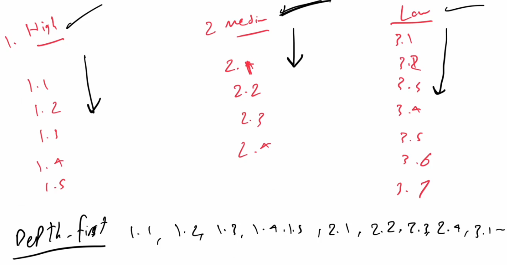
  - ✅ **breadth-first**: exekuujeme alespoň 1 (nebo 2,3..) TC z každého level (high, medium i low level) v každé iteraci.
    - výhoda: <span style="color:DarkMagenta">**exekuujeme všechny TC na všech risk levels**</span>.
    - nevýhoda: pokud máme nedostatek času, zdrojů nebo peněž, pak **nemusíme exekuuovat všechny high risk TC**.
    - použít v případě, že <mark>**stakeholder chce celkový přehled o kvalitě produktu**</mark> co možná nejdříve.

    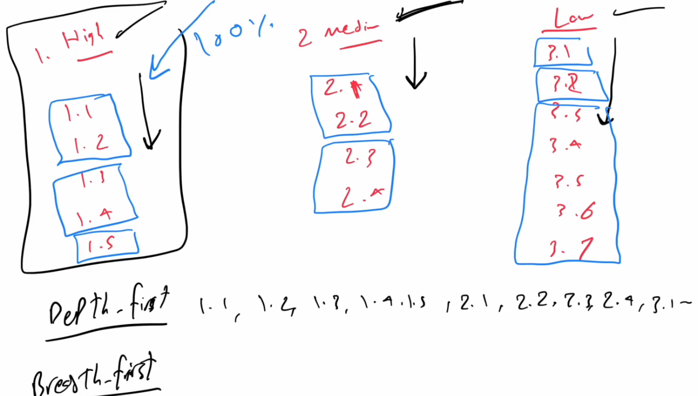
- **rozhodnotí jakou techniku zvolit je pak na TM** (žádná technika není ideální).
- **v praxi** začínáme depth-first technikou, kdy postupujeme od nejvyšší rizika postupně k nejmenšímu riziku a pokud zbyde čas, pak vše dotestujeme.
  - ❗ <mark>**pak můžeme nechat management buď rozšířit čas na testování nebo akceptovat zbývající rizika.**</mark>

<u>TECHNIKY PRO RISK-BASED TESTING</u>
- použitá technika záleží na povaze projektu = **pro kritický projekt (projekt v zdravotnictví, automotive, letectví) použijeme jiné techniky než pro "jednoduchý" projekt (gaming, e-commerce)**.

**KRITICKÉ/SLOŽITÉ/PŘESNÉ TECHNIKY**
- <span style="color:DarkMagenta">**kritické/přesné techniky pro složité projekty zahrnují detailní dokumentaci, dodržování procedur a přítomnost stakeholderů.**</span>
- kritické techniky **používají matematické vzorce** pro výpočet pravděpodobnosti a dopadu rizika.
- <span style="color:DarkMagenta">**pro složité/důležité projekty máme 4 hlavní techniky:**</span>
- 🔵 **hazard analysis (analýza nebezpečí)**
  - Zahrnuje identifikaci nebezpečí, posouzení jejich závažnosti a pravděpodobnosti a implementaci kontrolních opatření ke zmírnění rizik.
  - Analýza rizik je systematický proces, který identifikuje potenciální nebezpečí (situace nebo události s potenciálem způsobit újmu) v systému nebo procesu.
  - krom rizika anylýza ***dokáže identifikovat i nebezpečí(hazard)*** související s rizikem.
  - <u>jaké nebezpečí může nastat pokud se risk projeví v našem systému.</u>
  - v automotive je to nazýváno **HARA** = hazard analysis and risk assessment.
- 🔵 **Cost of exposure(náklady na expozici)**
  - se vztahuje k potenciálním finančním ztrátám, které mohou nastat v důsledku výskytu rizikového faktoru. Zahrnuje náklady na opravy, výpadky produkce, pokuty, soudní spory a další související výdaje. 
  - v normální risk analýze máme provaděpodobnost a dopad.
  - klasický dopad je zde rozšířen o náklady na ztrátu (typicky v podobě peněz) + o náklady na znovuotestování.
- 🔵 **Failure mode and effect analysis = FMEA**
  - ❗ FMEA je induktivní (zdola nahoru),
  - Identifikovat potenciální poruchy (failure modes) a jejich vliv na systém, produkt nebo proces.
  - uvažujeme zde i o příčinách selhání a prevenci jak jim předejít.
  - plus uvažujeme jaké efekty bude mít potencionální selhání.
    - **příklad:** Zkoumá, jak může selhání čerpadla ovlivnit celý systém chlazení. 
    - na základě FMEA **stanovujeme 3 faktory**: severita, priorita a detection rates.
- 🔵 **Fault tree analysis = FTA**
  - ❗ FTA je deduktivní (shora dolů).
  - Identifikovat příčiny definovaného nežádoucího stavu (top event) v systému.
  - Vytváří grafický model, který ukazuje logické vztahy mezi různými událostmi a podmínkami, které vedou k danému nežádoucímu stavu. 
  - Efektivní pro analýzu rizik v systémech s vysokými nároky na bezpečnost, jako jsou jaderné elektrárny nebo letecký průmysl. 
    - **příklad**: Zkoumá, jak kombinace selhání různých ventilů a čerpadel může vést k tavení aktivní zóny jaderného reaktoru. 

**příklad FTA**
- hledání příčiny přehrátí motoru.

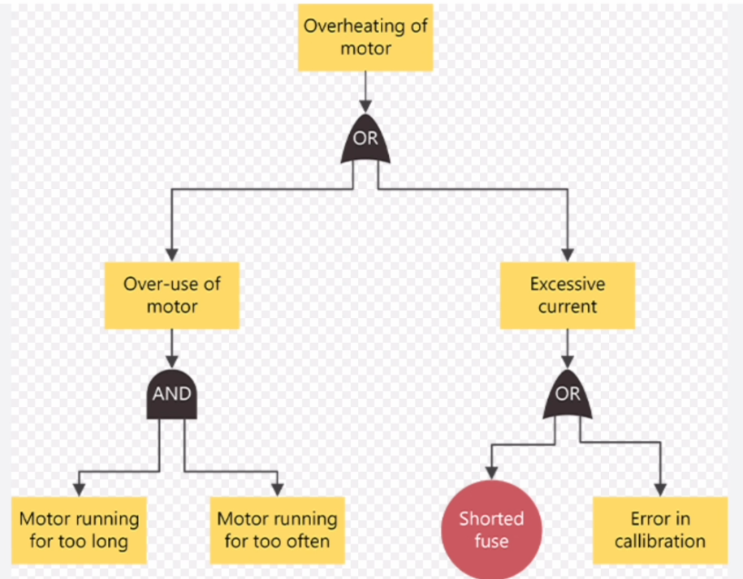

- ✅ <span style="color:DarkMagenta">**FTA a FMEA jsou nástroje pro analýzu rizik, zatímco cost of exposure je vyjádření finančního dopadu těchto rizik.**</span>
- ✅  **V podstatě:** FTA a FMEA jsou proaktivní metody hodnocení rizik používané k identifikaci a zmírňování potenciálních problémů, zatímco Cost of Exposure (Náklady na expozici) pomáhají kvantifikovat finanční dopad rizik. 
  - Analýza rizik (Hazard Analysis) je širší pojem pro identifikaci potenciálních nebezpečí a často se používá ve spojení s FTA ke zlepšení bezpečnosti.

**JEDNODUCHÉ TECHNIKY**
- opět jsou založeny na přítomnosti stakeholderů, ale jejich počet nemusí tak velký jako u složitějších technik.
  - někteří mohou chybětm někteří mohou být delegování apod.
- **měří se pouze praděpodobnost rizika a jeho dopad (např. 1-5 nebo low-hight)**.
- <span style="color:DarkMagenta">**pro jednoduché projekty máme 3 hlavní techniky:**</span>
  - 🔵 **Systematic Software Technique (SST)**: může být použita pouze v případě, že máme specifikaci požadavků resp. je na ní založena.
  - 🔵 **Pragmatic Risk Analysis and Management = PRAGMA**
  - 🔵 **Product Risk Management = PRISMA**

<u>ÚSPĚŠNÉ METRIKY A OBTÍŽNOSTI SPOJENÉ S RISK-BASED TECHNIKAMI</u>
- na konci risk-based analýzy = **v retrospektivě**, by měl testovací tým **stanovit rozsah benefitů, které nám přinasla risk-based analýza**.

**METRIKY**
- pro vyhodnocení si můžeme vytvořit checklist otázek = **můžeme ohodnotit - ANO/NE/ohodnotíme body 1 až 5**.
- <span style="color:Olive">**pro úspěšnou analýzu by jsem na všechny otázky měli odpovědět kladně resp. ANO.**</span>
  - 🔸 byly zapojeni všechni relevantní stakeholders? - ANO/NE/ohodnotíme body 1 až 5.
  - 🔸 bylo zapojení stakeholders dostatečné?
  - 🔸 byly vyřešeny kritické defekty, pokud se v produkčním prostředí nacházely nějaké kritické defeky, které nebyly odhaleny risk analýzou? = <span style="color:Olive">**zde je jediná správná odpověď NE**</span>
    - př. najdeme kritické defekty v produkci, ale v risk analýze jsme je neidentifikovali = **máme problém s nastavením risk analýzy.**
  - 🔸 byla většina důležitých/high priority defektů nalezena v rané fázi testování? = **pokud ano, pak je náše risk analýza OK.**
    - pokud ne a většina defektů byla odhalena později, pak **máme 2 problémy**:
      - [x] nalezený defekt byl špatně ohodnocený jako LOW, ale měl být HIGH = **proto byl odhalen později**.
      - [x] použili jsme špatnou techniku nebo jejich kombinaci: souvisí s DEPTH-FIRST, BREADTH-FIRST technikami.
  - 🔸 vysvětlil testovací tým dobře stakeholderům rizika, která mohou nastat? = **souvisí to reportingem**.
  - 🔸 přeskočili jsem nějaké testy s low level?
-  **na základě odpovědí můžeme nastavit konkrétní metriky, případně je upravit pro risk based anylýzu.**

**OBTÍŽNOSTI**
- 🔸**stanovení risk level**: risk je správně identifikován, ale špatně ohodnocen.
- 🔸**počáteční nadšení**: z počátku provádíme risk based testing, ale jak projekt postupuje, tak opustíme risk based testing a sklouzneme k klasickému testování = **máme pouze omezený čas projekt (jsme pod časovým tlakem)**.
- 🔸**Déjà vu [dežaví]**: ty samá rizika se opakují pro každý projekt resp.stakeholders nám opakovaně dávají stejná rizika pro každý projekt = **neprovádíme inovace ani nezařazujeme nové scénáře**.
  - **řešení**: k procesu identifikace rizik pozvat pouze lidi, kteří přinesou nějakou novou hodnotu (není nutné tam zvát každého člena týmu) + zmírníme pouze rizika, která jsou důležitá (ne nutně všechny rizika jsou důležitá).
- 🔸**opomenutí klíčových rizik**: problém bývá většinou s stakeholders = **jsou nedostatečně zkušení nebo nejsou vhodní pro identifikaci rizik**.
  - **řešení**: zapojení pouze vhodných lidí + tréning lidí.
- 🔸**změna/výměna stakeholders**: stakeholders se mohou v čase měnit, mohou se objevit nová rizika, a proto by měla risk analýza být **kontinuální, iterativní proces**.

<u>OTÁZKY K RISK BASED TESTING</u>
```txt
Projekt se rozhodl, že přesune web aplikaci do cloudu. Pravděpodobnost výpadku napětí serverů je velmi malá. Proto se testeři rozhodli pro neprovedení testů spolehlivosti ačkoli by byl dopad rizika velký.
Celkové riziko by neospravedlnilo použitý ddatečný čas a úsilí vynaložené na tyto testy.
Krátce po spuštění byly webové stránky nedostupné po 2 dny, což způsobilo ztrátu důvěry společnosti
```
- ❔ **jak by mohl testovací team zdokonalit svou risk-based analýzu, aby k tomuto příště nedošlo?**
  - ❗ ***pravěpodobnost byla malá, ale riziko bylo vysoké.***
  - problém je, že **provozovatel serveru měl nějaký (špatný) předpoklad** = došlo k **ŠPATNĚ NASTAVENÉMU RISK LEVELU**.
- **správná odpověď A**: <u>je relevantní, protože cílí k lepšímu nastavení pravděpodobni a úrovně risku skrze přidání stakeholders.</u>
- **odpověď B**: není správná, protože dle zadání máme málo času a nemůžeme provést reliability testy pro všechny tytpy testů, kde je moderate riziko + překročili by jsme budget.
- **odpověď C**: by mohla být správná, ale odpověď A je více obecná (správnější), protože stakeholders mají např. více informací/zkušeností...apod.
- **odpověď D**: není správná, protože risk based testing byla provedena.

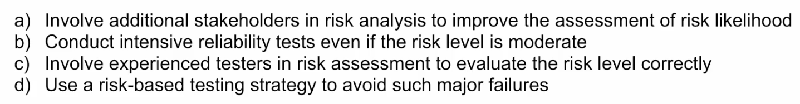

```txt
Jako TM vytvořím dokument/tabulku, kde na řádcích budou jednotlivé komponenty systému a v sloupcích budou hodnoty selhání tedy pravděpodobnost sehání a dopad selhání.
Pozvu systémové architekty a provozáky, aby vyplnili tabulku komponentů spolu s hodnotami selhání.
```
- ❔ **jakou risk identification techniku použiji pro tuto proceduru?**
- **odpověď A**: není správná, protože rozhovory jsme neprovedly, pouze jsme je požádali o vyplnění tabulky.
- **odpověď B**: není správná, protože nemáme checklist.
- **správná odpověď C**: <u>jedná se o případ risk workshopu, kdy pořádáme setkání s stakeholders a požádáme je o vyplnění tabulky na základě jejich zlušeností.</u>
- **odpověď D**: není správná, protože se nejedná o generování nějakých nápadů = není to brainstorming.

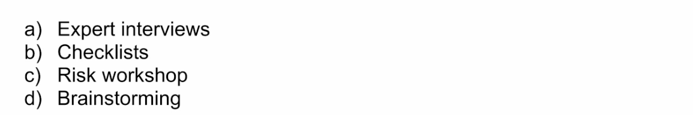

```txt
Rizika pro projekt byly vyjádřeny pomocí quantitativních metod (pomocí čísel) = byly stanoveny pravděpobnosti rizika a dopady na projekt.
```
- ❔ **jakou skupinu testovacích aktivit bude nejlepší provést k zmírnění rizik = musíme vypočítat risk rating?**.

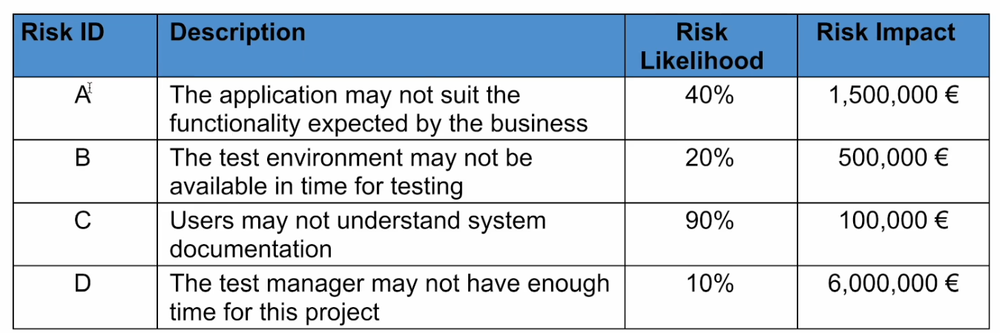

- **odpověď A**: <u>je správná odpověď. `risk rating je 600 000 EURO = (0.4 x 1500 000)`. Jedná se o product risk.</u>
- **odpověď B**: `risk rating je 100 000 EURO`. Toto není produkt risk, ale project risk = **odpověď B nepotřebuje žádný typ testování/testovacích aktivit (kterou hledáme) = musí být vyřešen pomocí manažerských aktivit.**
- **správná odpověď C**: `risk rating je 90 000 EURO`. Jedná se o product risk, protože zde mluvíme o systémové dokumentaci např. (user manual) = **vyžaduje static testing nebo review**.
- **odpověď D**: `risk rating je 600 000 EURO`
- největší rating z hlediska rizika mají odpovědi A + D, plus pouze odpovědi A + C jsou product risk (**vyžadují testovací aktivity**) a ostatní jsou product risk (**vyžadují managerské aktivity**).

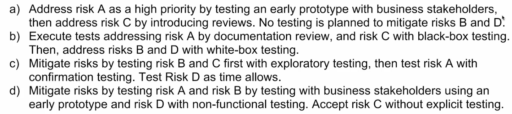

```txt
Jsme v projektu, který vyvíjí web aplikaci pro online banking. Projekt jede podle agilního SDLC a má 4 sprinty každé 2 týdny. Aplikace má mnoho funkcionalit s různou úrovní rizik v oblastech zabezpečení, použitelnosti a performance.
Máme tým 6 testerů s různou úrovní zkušeností a dovedností.
```
- ❔ **jakou skupinu testovacích aktivit bude nejlepší provést k zmírnění rizik na základě risk level?**
- **odpověď A**: <u>je správná odpověď</u>.
- **odpověď B**: není správná odpověď = statické testování pro low risk level a dynamické testování pro high risk level není dobrá volba = **neměly bychom přidělovat typ testování náhodně**.
  - stejně jako bychom neměli přidělovat testery náhodně k testování funkcionalit = **musíme přidělovat testery na základě jejich zkušeností a dovedností**.
- **správná odpověď C**: není správná odpověď. Neměly bychom přeskočit testování na low level risk level = ❗ **měli bychom je pokrýt ale s menší pečlivostí/důsledností a menším počtem TC**.
  - ❗ testery bychom neměli přiřazovat na základě jejich preferencí. **To můžeme udělat v případě, že mám stejně kvalitní testery a 2 stejné/podobné úlohy**.
- **odpověď D**: totálně špatně. Potřebuje statické i dynamické testování pro high risk level funkcionality.

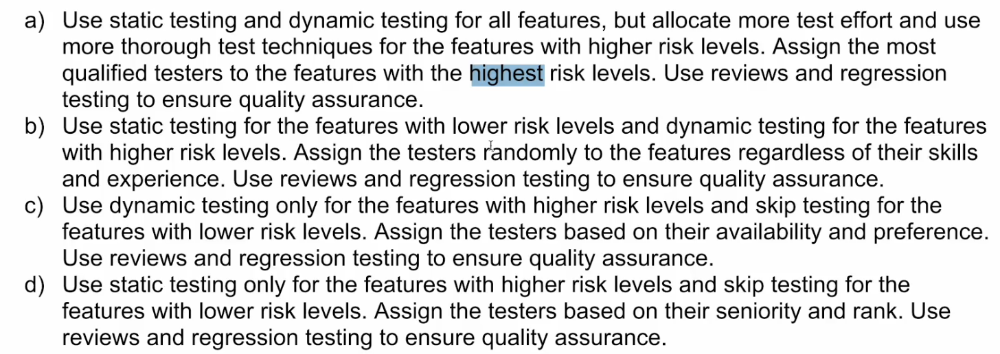

```txt
Tým vytváří novou verzi aplikace a používá agilní SDLC (hodně sprintů a ryychlé releasy). Požadavky jsou sbírány z zpětné vazby od uživatelů a vývoje a jsou spíše informativní. 
Je požadován risk-based testing. Pro vytvoření risk based analýzy potřebujeme zahrnout takové členy agilního týmu, kteří jsou obeznámeni s riziky v onlasti performance, usability, kompatibility aj.
```
- ❔ **jaké techniky by jsi dopouručil použít v této situaci?**
- v této situaci potřebujeme ligh-weight přístup nebo techniku.
- **odpověď A**: jedná se o časově náročnou heavy-wight techniku.
- **odpověď B**: jedná se o light-weight techniku, která je založená na vstupech od stakeholders (feedback od uživatelů a z vývoje).
- **správná odpověď C**: vyžaduje requirements specifikaci naspanou v fobrém formátu a zde máme pouze zpětnou vazbu od uživatelů a z informace z vývoje.
- **odpověď D**: jedná se o časově náročnou heavy-wight techniku.

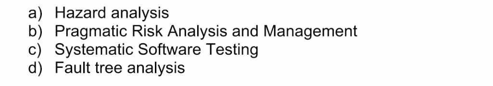

- ❔ **Který z následujících způsobů je způsobem, jakým analýza řídí provádění testů?**
- **odpověď A**: <u>správná odpověď = testy, které mají větší pravděpodobnost a dopad jsou exekuovány první.</u>
- **odpověď B**: není správná = popisuje vztah mezi test analýzou (řešíme test conditions) risk analýzou, ale dle zadání je potřeba řešit vztah mezi risk analýzou a test exekucí.
- **správná odpověď C**: není správná = za formát reportu je odpovědný stakeholder
- **odpověď D**: není správná = v risk analýze přemýšlíme o problému ještě předtím, než nastane.

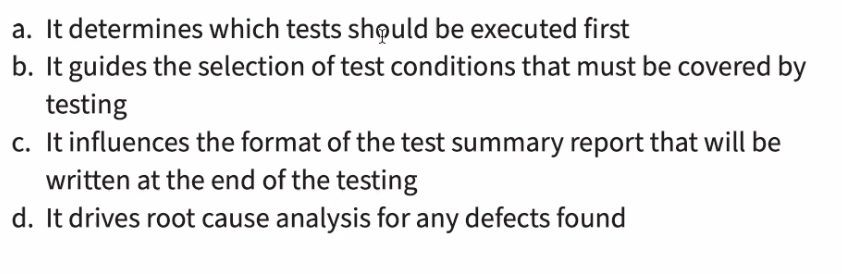

- **odpověď A**: <u>správná odpověď = ovlivňuje pravděpodobnost.</u>
- **odpověď B**: není správná = jedná se o dopad.
- **správná odpověď C**: není správná = jedná se o dopad.
- **odpověď D**: není správná = jedná se o dopad.

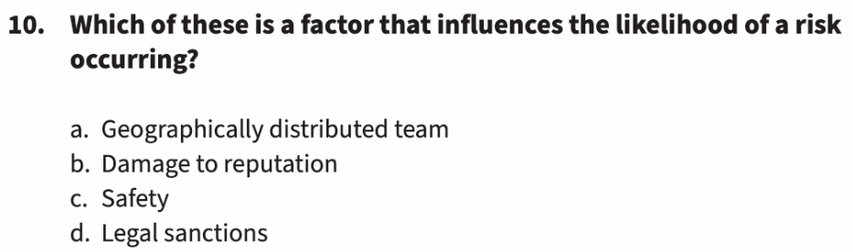

```txt
Jsem odpovědný za managing testování na bankovním projektu. Testování bylo naplánováno na 10 týdnů, ale vzhledem k zpožděnému vývoji na to je nyní pouze 6 týdnů.
Testovací tým začal hned testovat, provedl code review, definoval akceptační kriteria...atd
Nyní jsme 3 dny od startu aplikace do provozu. Testování zmírnilo vysoká a střední rizika a ponechalo pouze rizika s nízkým levelem, která nejsou pokrytá.
Pro manuální otestování rizik s nízkým levelem je odhad 2 týdny.
```
- ❔ **Co budeme nyní dělat?**
- **odpověď A**: není správná = automatizované testování trvá mnohem déle než manuální testování (na začátku) a máme pouze 3 dny do startu.
- **odpověď B**: není správná = nemusíme blokovat uvedení aplikace do provozu (vysoká a střední rizika jsou pokryta).
- **správná odpověď C**: <u>správná odpověď = použijeme **BREATH FIRST TESTING**.</u> = ***spustím 1 nejvíce důležitý TC z každého rizika***.
- **odpověď D**: není správná.

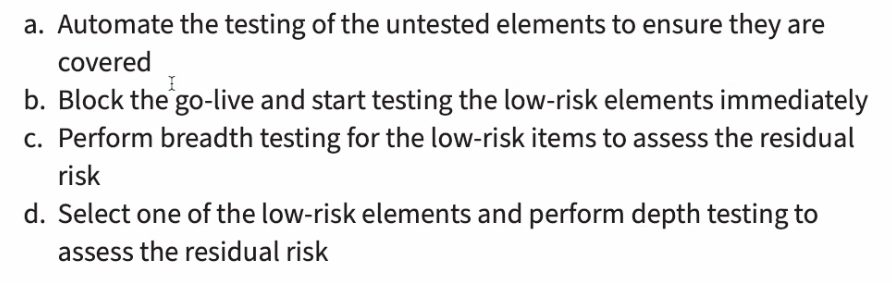

```txt
Jsem odpovědný za managing testování na mobilní aplikaci, která poskytuje "step-by-step hiking guide". Rozdělení rizik je v tabulce.
```

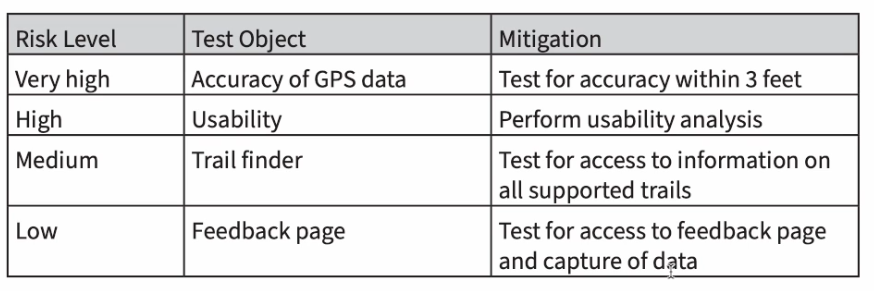

- ❔ **Jaký typ testování pro Accuracy of GPS Data (velmi vysoké riziko)?**
- **odpověď A**: <u>správná odpověď = pro velmi vysoké riziko je dobré použít obě techniky: BREATH FIRST i DEPTH FIRST.</u>
- **odpověď B**: není správná = řešíme přesnost GPS dat a ne použitelnost.
- **správná odpověď C**: není správná = řešíme přesnost GPS dat a ne trail fider.
- **odpověď D**: není správná.

```txt
Dokončili jsem projekt, který byl nasazen do produkce. Přestože jsme provedli risk-based analýzu, v produkci se objevily významné chyby.
Po analýze, ke se stala chyba, bylo zjištěno, že klíčová rizika byly v analýze opomenuty.
```

- ❔ **Co musím udělat proto, aby se situace příště neopakovala?**
- **odpověď A**: není správná = mluvíme zde o rizicích, která jsou identifikována, ale problém je právě s riziky, která identifikována nebyla.
- **odpověď B**: není správná = stejně jako odpověď A.
- **správná odpověď C**: <u>správná odpověď</u>
- **odpověď D**: opět se zde nemluví o identifikaci rizik.

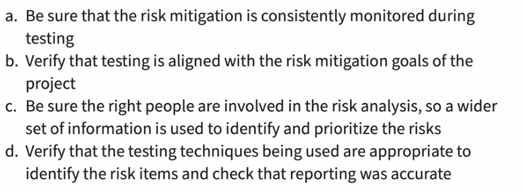

<hr style="height:1px;border-top:1px solid #f00" />

##### test strategy
### PROJEKT TEST STRATEGY
#### <ul><li>INTRO</li><li>PŘÍSTUP K TESTOVÁNÍ (TEST APPROACH)</li><li>ANALÝZA ORGANIZATION TEST STRATEGY</li><li>DEFINICE TEST OBJECTIVES</li><li>OTÁZKY K TEST STRATEGY</li></ul>

<u>INTRO</u>
- **projekt test strategy (PTS)** je strategie pro projekt, release, produkt nebo pro jakýkoli jiný vývoj systému = <span style="color:DeepSkyBlue">**POPISUJE PŘÍSTUP K TESTOVÁNÍ**.</span>
  - ✅ projekt test strategy nemusí být nutně vztažena k celému projektu, ale <span style="color:DeepSkyBlue">**může být vztažena pouze k části projektu nebo test levelu nebo pouze k nějakému typu testování**</span>.
  - vedle projektové strategie máme také **organization test strategy (OTS)**.

```txt
Popisuje přístup k testování v konkrétním kontextu tak, aby bylo možné dosáhnout cílů organizace, zejména těch, které se týkají kvality produktu a testovacích aktivit.
```
- projekt test strategy je **hlavním výstupem z TEST PLANNIGU**.
  - [ ] strategie může být typicky uvedena/zanesena přímo v testovacím plánu jako jeho součást nebo v samostatném dokumentu.
  - [ ] strategie je nejčastěji zdokumentována v sequenčním modelu vývoje, v agilním nebo hybridním modelu zdokumentována být nemusí.

<u>PŘÍSTUP K TESTOVÁNÍ (TEST APPROACH)</u>
- 🔵 PTS by měla být určovat všechny testovací aktivity v rámci projektu: zdroje pro testování, odpovědnosti za testy, časové plány na testování a testované funkcionality.
  - **PTS by měla být přizpůsobena konkrétním požadavkům projektu**: 
    - jaké použijeme typy testů, jaký bude test level, jaké techniky použijeme pro statické a dynamické testování
    - jaké automatizované skripty použijeme, kde bude vhodný manuální testing, jaké sanity a smoke testy použijeme...apod.
    - včetně toho, kdo toto testování bude provádět.
    - ❗ <span style="color:DeepSkyBlue">**veškeré testování by mělo být maximálně efektivní**</span> tzn. že např. performance testy by měly být prováděny automatizovaně (př. JMETER ) nebo testování kodu je lepší provádět pomocí statické analýzy kodu.
    - = **kombinujeme různé typy testů, různé testovací techniky pro různé úrovně testů**.

<u>ANALÝZA ORGANIZATION TEST STRATEGY</u>
- PTS je ovlivněna nejen obsahem projektu ale také testovací strategií organizace (OTS).

**faktory ovlivňující test approach**
- ✳️ pokud chceme zvolit odpovídající přístup k testování **musíme analyzovat následující 7 faktorů**:
- 🔸 <u>**domain (oblast)**</u>
  - jakou oblast pokrývá naše aplikace, kam zapadá (do jakého odvětví)?
  - každá oblast obsahuje standarty, regulace, které ovlivní navrhované testy, požadovanou dokumentaci, level testování apod.
    - př. v oblasti medicíny budeme provádět nejvíce akceptační testování vzhledem k riziku na pocientově zdraví.
    - ty samé testy ale nebudem provádět v automotive.
    - pro testování webových stránek se nejčastěji používá A/B testing (máme 2 verze aplikace, které se testují uživateli, vítězí ta lepší.)
- 🔸 <u>**cíl organizace a demonstrace quality**</u>
  - **jedná se o ukázku kvality testingu jako takového**.
  - př. myslíme si, že naše aplikace nepotřebuje mnoho automatizace, ale senior test manager rozhodne o zařazení autom. testů jako projevu vyspělosti testovacího týmu a možnéhio uplatnění na jiných projektech.
  - = **použijeme automatizaci, i když to není příliš přínosné pro aktuální projekt.**
  - cíl organizace může být např. to, zže potřebujeme experty na automatizaci, protože chceme automatizované testy.
- 🔸 <u>**cíl projektu a typ projektu**</u>
  - každý projekt obsahuje nějaká rizika a omezení ***př. omezený budget na testování, omezení na kvalitu produktu, specifické požadavky na produkt z pohledu zákazníka apod..*** = **TO VŠE OVLIVŇUJE TEST PROCES**
    - pokud máme např. omezený čas na testování a omezený budget, apk musíme udělat <span style="color:DeepSkyBlue">**RISK-BASED ANALÝZU A PRIORITIZOVAT TESTOVACÍ PŘÍPADY**</span> = nemáme čas na exekuci všech testovacích případů.
    - pokud ale máme produkt speciálně zaměřený na zákazníka, musíme přizpůsobit testy, které jsou zaměřené **nebo přímo navržené zákazníkem**.
  - cílem projektu může být např. to že chceme menší podíl regresních chyb = **aplikujeme automatizované testy, ale s odlišným cílem, který je vztažený k projektu.**
- 🔸 <u>**test resources**</u>
  - pokud chci např. provádět testování založené na zkušenostech = **experience based testing** = **potřebuji zkušené testery**.
  - např. pro mobile testing potřebuji testovací zařízení, na kterých budu testovat. 
  - musím např. i vhodně zvolit nástroj pro automatizaci testů z hlediska nákladů, test týmu apod.
- 🔸 <u>**SDLC model použitý pro projekt**</u>
  - musíme definovat test levels, vstupní a výstupní kriteria.
  - projekt s CI bude obsahovat více automatizovných testů + odlišné typy testů, odlušné úrovně testů než projekt bez CI.
- 🔸 <u>**rozhraní s jinými systémy**</u>
  - **některé systémy jsou integrované s jinými systémy, a proto je vhodné provádět integrační testy** + pomocí risk-based analýzy je prioritizovat a zvolit vhodný test level.
- 🔸 <u>**dostupnost testovacích dat**</u>
  - <span style="color:DeepSkyBlue">**můžeme použít testovací data z produkce a následně je anonymizovat.**</span>
  - můžeme si vytvořit speciální testovací data, která potřebujeme.
- ✅ <u>TM by měl stanovit jaké typy testů, testovací techniky a jaký test level zvolit pro naplnění OTS, obsahu projektu a jiných faktorů vztahujících se k testování.</u>

<u>DEFINICE TEST OBJECTIVES</u>
- příklad test objektives (TE): validace uživatelů, verifikace požadavků, redukce rizik aj = **TO JSOU OBECNÉ TEST OBJEKTIVES**.
  - <span style="color:DeepSkyBlue">**každý projekt může mít svoje vlastní test objectives**</span>
- test objectives by měly být definovány v test plánu.
- test plán může být stanoven:
  - [x] pro **aktuální release** jako projekt test plán neboli **MASTER TEST PLAN**
  - [x] pro daný **test level**
  - [x] pro danou quality charakteristiku jako **security test plan** nebo **performance test plan**.
  - [x] agilní nebo hybridní projekty mají **iterační test plán**.
- 🔵 každý test plán by měl obsahovat **scope funkcionálních a nefunkcionálních charakteristik**, které mají být dodány (otestovány) a má to být schváleno stakeholdery.
- test objectives a exit kriteria, která mají být obsažena v test plánu mohou být **stanovena pomocí S.M.A.R.T goal techniky**.

**S.M.A.R.T goal technika**
- pro stanovení test objectives a exit kriterií
  - **S=specific**: TE by měly být srozumitelný a jednoznačný.
  - **M=measureable**: TE by mělo být možno kvantifikovat + mít stanovena kriteria/hodnoty na základě nichž můžeme rozhodnout zda TE byly naplněny či nikoli.
  - **A=achiable/dosažitelný**: TE by mělo být možno dosáhnout vzhledem k dostupným zdrojům, poskytnutému času a schopnostem týmu.
  - **R=relevant**: TE by měly být v souladu s project objectives + organization objectives.
  - **T=timely**: měl by být stanoven deathline pro dokončení nebo nějaký časový rámec pro plnění TE.

**příklady project TE definovaných pomocí S.M.A.R.T goal techniky**
- ❗ <span style="color:DeepSkyBlue">**měly by být obsaženy/zaneseny v test plánu nebo test strategy.**</span>
- dosažení exit kriterií v stanoveném čase
- splnění organizačních kriterií kvality = **KPI indikátor splnění počtu požadavků zákazníků na produkt**
- dodržení požadavků, regulací a providel specifických pro dané odvětví.
- ujištění se, že data jsou dostupná pouze oprávněným uživatelům = **přístupová oprávnění**
  - př.: konkrétní stránky můžou být viditelné pouze skupině uživatelů př. managerům.
- kontrola kompletní funkčnosti, správné funkčnosti, performance, přenosti a zabezpečení dat.
- posílení test automatizace obzváště pro **regresní a performance testy**.
  - splňuje náš kod pro automatizované testy design patterns anebo automatizační standarty?
- refactoring kodu a ujištění se, že **refaktoringem nejsou zaneseny nové chyby**.
  - př. refactoringu: odstranění nedostatečně strukturovaného kodu.
- **zabezpečení rozhraní**: př. pokud máme XML data, tak je validujeme podle **XML Schema Definition**, a tím zamezíme vložení podvržených dat.
- kontrola použitelnosti uživatelského rozhraní např. určitá akce (dokončení objednávky na 1. pokus) musí trvat maximálně nějaký stanovený čas
  - při opakovaných pokusech se čas potřebný pro dokončení objednávky již zmenšuje (zákazník je naučený) = **LEARNEABILITY** = **APLIKACE JE LEARNABLE**.

**co je potřeba zohlednit**
- při plánování exit kriterií je potřeba např. zohlednit, že ne vždy budou dostupná všechna testovací prostředí (máme jich více - INT, AKC, PROD, DEV..aj) z nějakých důvodů = **dojte k posunu času dokončení**.
  - každé testovací prostředí může obsahovat jiné dostupné zdroje a jiné nástroje.
  - určité testovací prostředí může být dostupné v jiných časech.

<u>OTÁZKY K TEST STRATEGY</u>

- <span style="color:DeepSkyBlue">**TEST APPROACH JE SOUČÁSTÍ TEST STRATEGY.**</span>
- ❔ **Jaká klíčová rozhodnutí musíme učinit pro výběr testovacího přístupu (test approach)?**
- **odpověď A**: není správná = test type a test technique je součástí test approach, ale test metriky již nikoli (je součástií test strategy).
- **odpověď B**: není správná = entry a exit kriteria nejsou součástí test approach, ale test stategy.
- **odpověď C**: <u>správná odpověď</u>
- **odpověď D**: test deliverables jsou součásí test strategy.

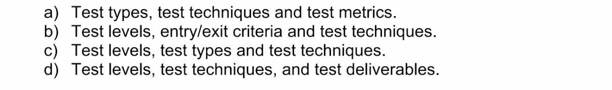

```txt
Předpokládejme, že jsi členem projektu, který vytváří sw produkt pro bankovní sektor. Jsi zodpovědný za analýzu a organizaci test strategy a musíš vybrat odpovídající test approach.
Musíš vzít v úvahu následující faktory.
```

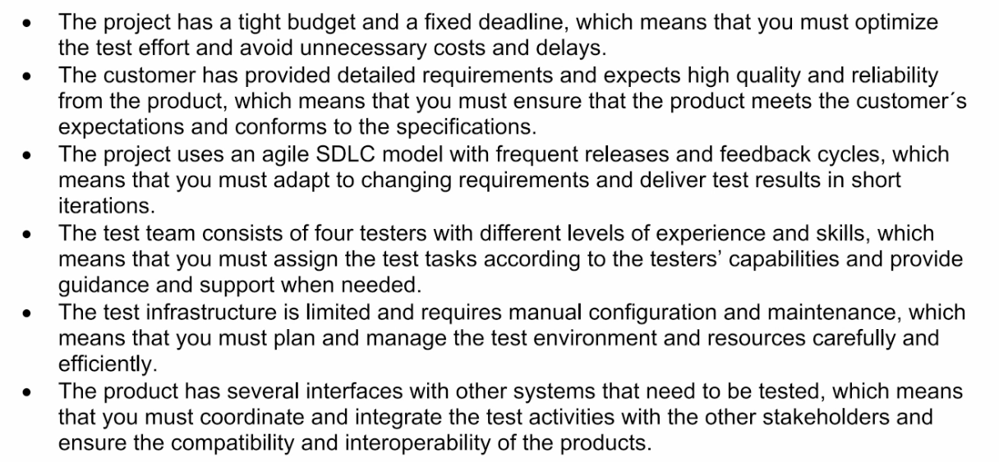
- ❔ **Který z následujících test approaches budu vhodný pro projekt?**
- ❗ v projektu máme mnoho rizik, které musíme prioritizovat.
- **odpověď A**: <u>je správná = nemáme čas všechno testovat, máme fixní budget a fixní termíny dokončení.</u>
- **odpověď B**: není správná = model based testing vyžaduje mnoho investic = **pro vytvoření modelu spotřebujeme mnoho budgetu**.
  - model base testing navíc vyžaduje **stabilní = neměnící se** a kompletní dokumentaci.
- **odpověď C**: může být součástí mého test approach v některých částech projektu, ale ne jako hlavní test approach.
- **odpověď D**: zaměření je pouze na akceptační testování, ale v projektu se musíme zaměřit i na jiné úrovně testování.

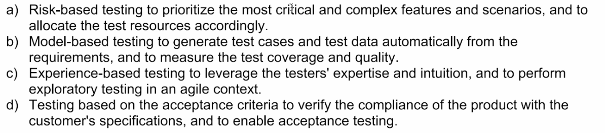

```txt
Předpokládejme, že jsi členem projektu, který vytváří sw produkt pro bankovní sektor. Projekt je v režiji zákazníka a má přísné požadavky na bezpečnost, performance..aj
Projekt používá agilní SDLC model s 2-týdeními sprinty. Tým má 4 testery s různou úrovní dpvedností. Infrastruktura projektu je cloud-based s různými prohlížeči a zařízeními.
Test data jsou poskytiována zákazníkem a před použitím musí být anonymizována.
```

- ❔ **Který z následujících test approaches budu vhodný pro projekt?**
- **odpověď A**: <u>je správná</u>
- **odpověď B**: není správná = aplikace má striktní požadavky na bezpečnost, performance..aj, a přesto je **pouze 90% pokrytí větví** (tam, kde jsou striktní požadavky na bezpečnost se očekává 100%).
  - ❗ tam, kde používáme **WHITEBOX TESTING** je očekáváno 100% pokrytí větví testy.
- **odpověď C**: není správná = aplikace má striktní požadavky na bezpečnost, performance..aj + je to aplikace pro bankovní sektor = **pořebujeme explicitně definovat test levels**.
  - ❗ zároveň nemůžeme jenom používat exploratory testing.
- **odpověď D**: není správná = zaměřuje se na funcionálí testování, ale je požadováno i security testování, performance testování aj.
  - plus nedává smysl zaměření na funcionální testy v unit testování.

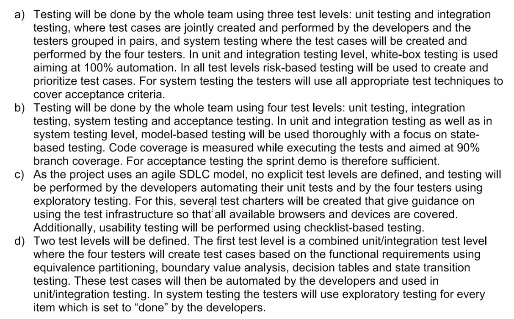

```txt
Jsi členem týmu, který testuje e-commerce webovou stránku. Tým dostak následující požadavky od managementu.
Systém musí být "defekt-free".
```

- ❔ **Vyber nejvhodnější revizi podle S.M.A.R.T kriterií a s přihlédnutím k komplexivitě a omezeným testovacím zdrojům, která splňuje požadavek "defekt-free".**
- **odpověď A**: není správná = slovo `serious defekt` je neurčité (je to defekt s high, medium nebo low prioritou)?
- **odpověď B**: <u>je správná: je to smart = **specifické(specific), dosažitelné(achievable - byť obtížně) a meřitelné(mesureable) zadání vyjádřené čísly**, ale na druhou stranu obtížně splnitelný požadavek (méně chyb jak 1%).</u>
- **odpověď C**: není správná = požadavek není dosažitelný(achievable) = **pro dlohou periodu 1 roku**.
- **odpověď D**: není správná = např. když zredukujeme o 50% kritických defektů oproti předchozí verzi, tak stále budeme mít 50% defektů = **není to dostatečné**.

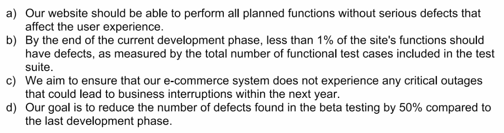

```txt
Jsi test manager na projektu, který testuje mobilní aplikaci pro online shopping.
Projekt má vysoké požadavky na funkcionalitu, komplexivitu a použitelnost. Projekt využívá hybridní model s 4-měsíční releasy a měsíčními iteracemi.
Testovací tým má 6 testerů s různými úrovněmi znalostí. Infrastruktura projektu je cloud-based s různými prohlížeči a zařízeními.
Testovací data jsou generováná nástroji a musí být před použitím validována.
```

- ❔ **Vybej nejvhodnější test objective podle S.M.A.R.T kriterií.**
- **odpověď A**: <u>je správná = kontroluji usability = **je to S.M.A.R.T**</u>
- **odpověď B**: není správná = to není cíl, kterého chceme dosáhnout.
- **odpověď C**: není správná = není definováno, jak toho dosáhneme.
- **odpověď D**: není správná = cíl není dosažitelný (př. nemůžeme vyzkoušet všechna zařízení obzvláště v na mobilních zařízeních typu telefonů).

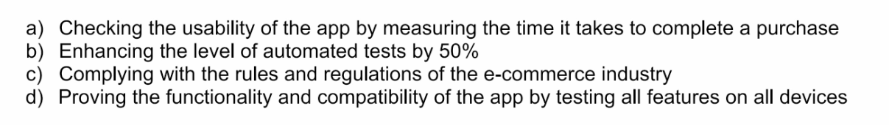

- ❔ **Co vyžaduje WHITEBOX TESTING přístup?**
- **odpověď C**: <u>je správná</u>.

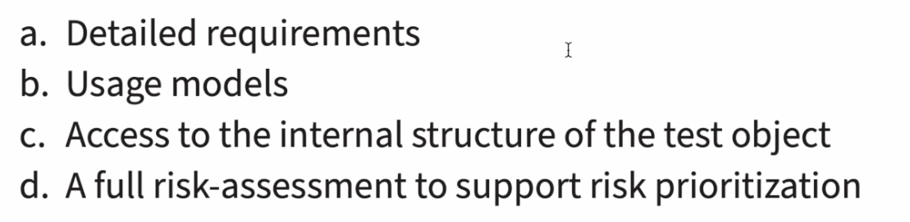

```txt
Váš tým byl přiřazen na testování karetního programu pro supermarket. Některé funcionality mají vysoký dopad na zkušenost zákazníka a tyto funkcionality byly pro testování prioritizovány, aby se tam nevyskytly chyby.
Čas na testování je omezený, a proto by yměl být maximálně efektivně využit.
```

- ❔ **Jaký zvolíme testovací přístup?**
- **odpověď C**: <u>je správná</u>.

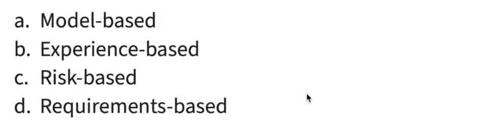

```txt
Váš tým byl přiřazen na testování projektu, který se zabývá krevními testy a označuje jakékoli anomálie. Projekt musí být schválen FDA před uvedením na trh.
```

- ❔ **Jaký zvolíme testovací přístup?**
- **odpověď B**: <u>je správná</u>.

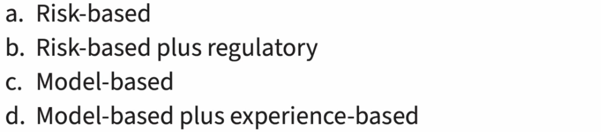

```txt
Váš tým opakovaně uvolnil do produkce produkt, který nemá adekvátní zabezpečení = kdokoli může dělat cokoli. Do dalšího releasu musí být splněny následující požadavky:
- přístupová oprávnění musí být nastavena podle funkcionalit a testována podle access matrix.
```

- ❔ **Který z následujících případů pravděpodobně představuje problém s definicí tohoto cíle jako S.M.A.R.T?**
- **odpověď A**: <u>je správná.</u>
- **odpověď B**: není správná = co se musí udělat je specifikováno.
- **odpověď C**: není správná = je to velmi relevantní - problémem je bezpečnost a my testujeme přístupová oprávnění = **je to relevantní**.
- **odpověď D**: není správná = je to měřitelné (testujeme podle access matrix, která ukazuje, co má být vše testováno).

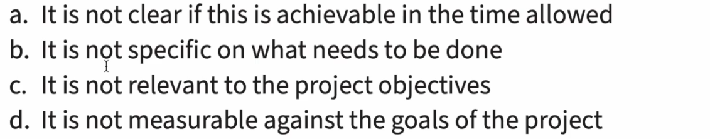

```txt
Rozhodl jste se, že zvýšíte kvalitu testování tím, že každý TC bude v stavu "unreviewed" dokud ho nezkontroluje jiný tester. Pak se přesune do stavu "reviewed" a může být exekuován.
Tým to cítí tak, že je zbytečně osočován z problému, kerý neexistuje = nízká kvalita testovacích případů.
```

- ❔ **Co chybí podle S.M.A.R.T a podle vašeho týmu?**
- ❗ máme goal = **zvýšení kvality testování** a každý goal by měl být **S.M.A.R.T**.
- **úkol je:**
  - [x] **je specifický** = je definováno jak to udělat-revize jiným testerem.
  - [x] **je měřitelný** = zkontrolavaný TC přechází z stavu "unreviewed" do stavu "reviewed".
  - [x] **je dosažitelný**
  - [x] <u>není relevantní = správná odpověď</u>

<hr style="height:1px;border-top:1px solid #f00" />

##### improve test process
### ZLEPŠOVÁNÍ TESTOVACÍHO PROCESU
#### <ul><li>ZLEPŠENÍ TESTOVACÍHO PROCESU: IDEAL</li><li>MODEL-BASED TEST PROCESS IMPROVEMENT</li></ul>
- ✅ testovací proces je potřeba zlepšovat už jen proto, že stojí kolem 30-40% všech nákladů na projekt.
- <u>**důvody pro zlepšování testtovacího procesu**:</u>
  - 🔸 **nejsme spokojeni s výsledky současných testů**.
  - 🔸 **máme neočekávané defekty**
  - 🔸 **nedostatek komunikace**
  - 🔸 **výsledky benchmarks**
- k zlepšení testovacího procesu existují různé techniky.

<u>ZLEPŠENÍ TESTOVACÍHO PROCESU: IDEAL</u>
- pro zlepšení testovacího procesu musíme obecně projít 5 základními body a musíme chtít ho zlepšit.
- IDEAL je založený na pdobných myšlenkách jako PDCA (plan-do-check-act) cyklu = <span style="color:Teal">**plánuj-udělej-zkontroluj-znova proveď**</span>
- 🔵 <span style="color:Teal">**I = Initiating = inicializace zlepšovacího procesu**</span>
  - dochází k identifikaci konkrétních bodů k zlepšení a rozsahu zlepšení a to celé je schváleno stakeholdery.
- 🔵 <span style="color:Teal">**D = Diagnostic = diagnostika současné situace**</span>
  - dochází k posouzení stávající situace.
  - posouzení je buď **proti standartizovanému modelu resp. frameworku => pak to je model-based process improvement**
  - nebo jsou použity **speciální metriky => pak to je analytic-based process improvement**
- 🔵 <span style="color:Teal">**E = Establish = ustanovaní zlepšovacího plánu**</span>
  - zlepšovací plán může mít podobu formálního dokumentu, který obsahuje konkrétní akce, které musí být dodrženy, aby došlo k zlepšení.
    - **dokument by měl být jasný a stručný** = **nic složitého**
    - jednotlivé body vedoucí k zlepšení by měly **být prioritizovány** na základě ROI, týmové nebo projektové strategie, měřených kavlitativní/kvatitativních benefitů, které to přinese...apod
- 🔵 <span style="color:Teal">**A = Acting = akce vedoucí k zlepšení**</span>
  - jedná se o implementaci plánu vedoucího k zlepšení.
  - typicky se jedná o tréning + zavedení pilotu změn pro testovací projekt a tým.
- 🔵 <span style="color:Teal">**L = Learning = učení se z zlepšovacího procesu**</span>
  - ověření jakých benefitů(plánovaných i neplánovaných) jsme dosáhli zavedením zlepšovacího programu.
  - ověření co fungovalo a co naopak nefungovalo + **spuštění dalšího kola zlepšovacího procesu**.

<u>MODEL-BASED TEST PROCESS IMPROVEMENT</u>
- ❗ jak pro model-based model, tak pro analytic-based model <span style="color:Teal">**platí předpoklad že kvalita projektu je ovlivněna kvalitou použitého procesu**</span>.
  - **čím kvalitnější process, tím kvalitnější produkt**.
- ✳️ používáme **test improvement model** = **tyto modely jsou založeny na BEST PRACTICES v testingu** a zavádějí se **POSTUPNĚ v krocích/bodech (máme seznam bodů k zlepšení a postupujeme krok po kroku)**.
- existuje mnoho modelů k zlepšení, ale zde použujeme dva: <u>TMMI a TPI NEXT</u>.

<u>TEST MATURITY MODEL INTEGRATION</u>
- skládá se z 5 úrovní, přičmž naše společnost je v jedné z těchto úrovní.
  - [x] level 1 znamená, že nemáme vyspělí testovací proces = **jedná se o ADD HOC testování, většina testů je manuálních, neexistuje plánování testování**.
  - [x] další levely obsahují již testovací proces + nějaké zlepšení oproti level 1.
    - následně posouváme společnost např. z level 1 do level 5 (který je nejvyspělejší z hlediska testování).
- TMMI je dnes nejvíce používaný model, který vychází z modelu <span style="color:Teal">**CMMI**</span>.
  - ❗  CMMI model **neklade důraz na testovací aktivity v procesu zlepšování** => proto byl vyvinut **model TMMI**.
  - spousta lidí, organizací a společností již **bylo certifikováno** v použivání tohoto modelu: https://www.tmmi.org/
  - některé věci v certifikaci se liší od ISTQB + jsou vysvětleny společné věci.
  - většina společností je na level 3.

**příklad TMMI levels**

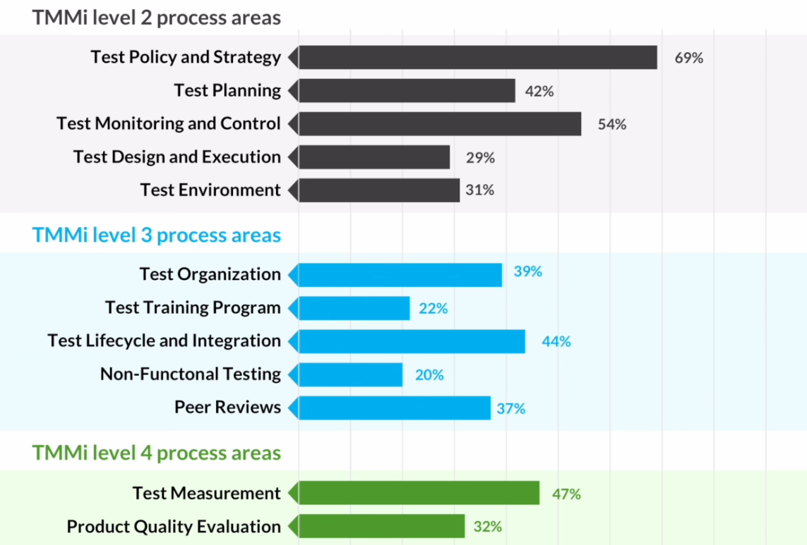

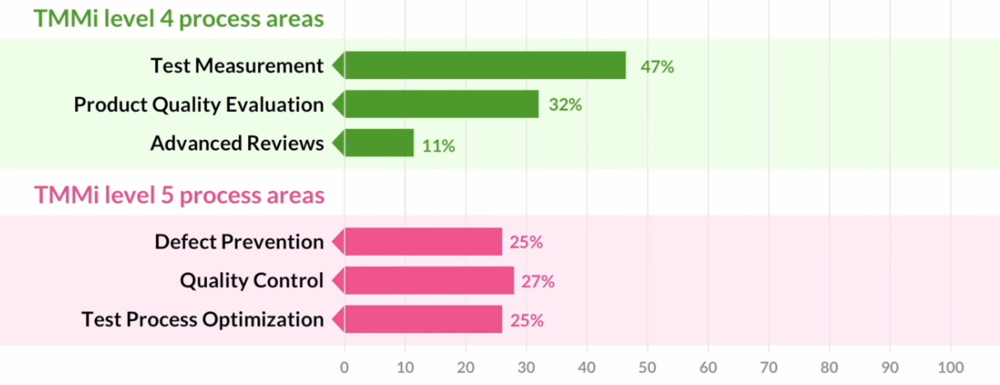

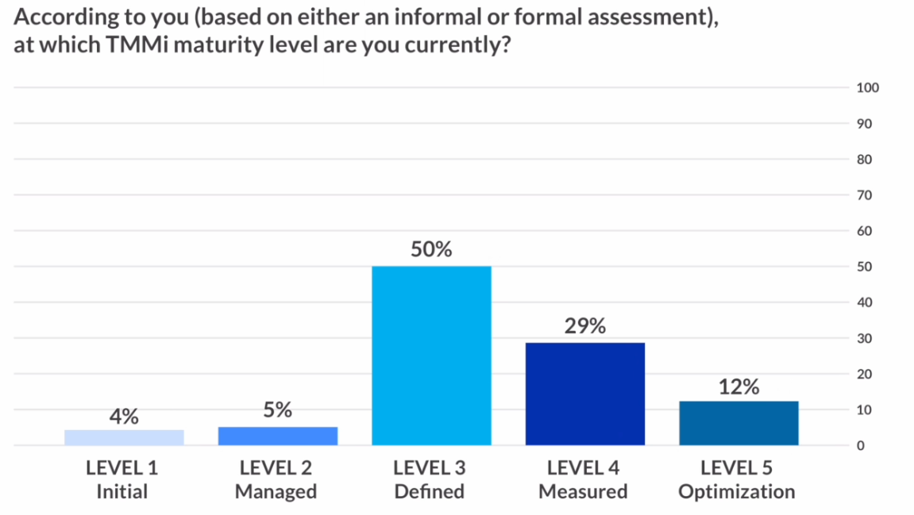

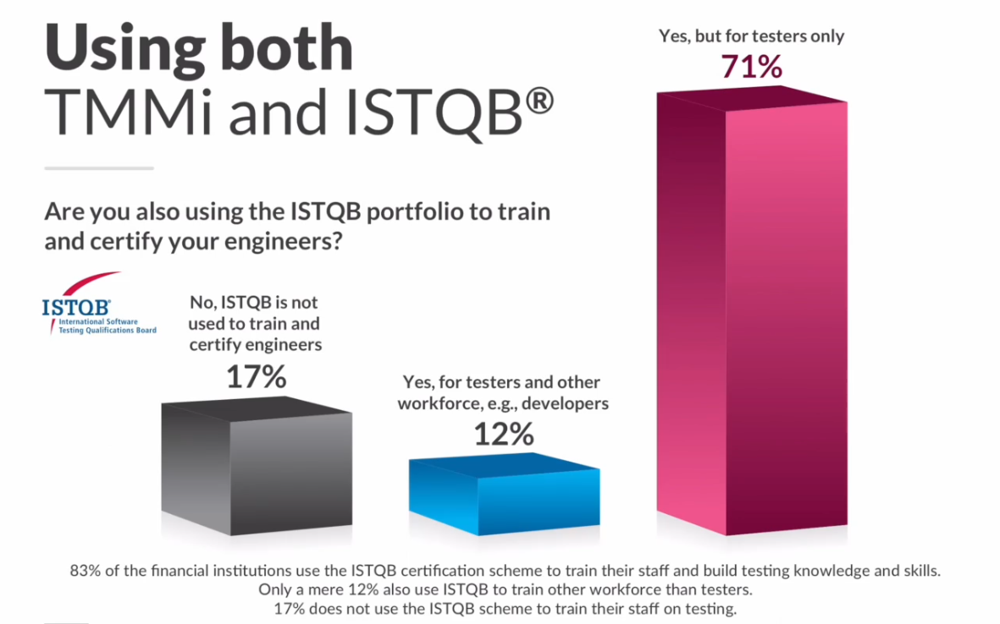

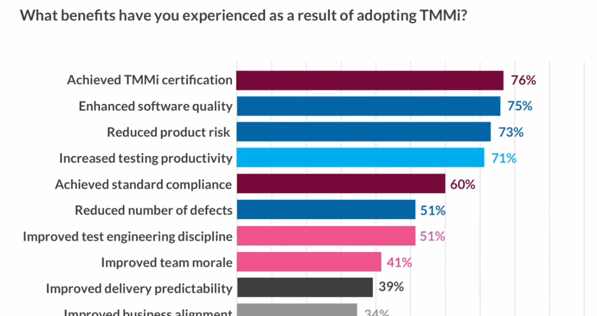

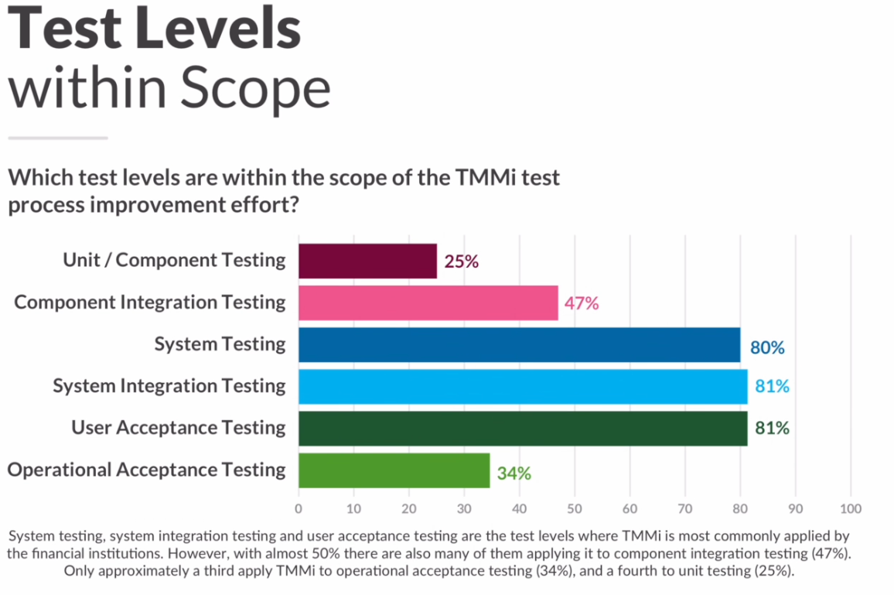

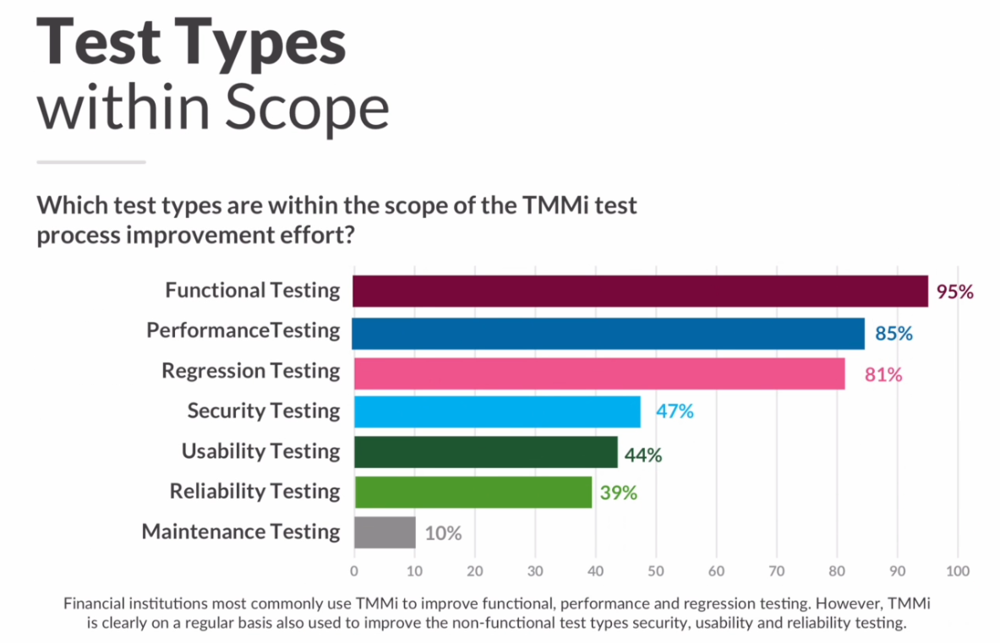

<u>TPI NEXT</u>
- definuje 16 klíčových oblastí, které pokrývají specifické oblasti testovacího procesu př. test strategy, test tools, test metricks...
- pro každou klíčovou oblast máme 5 úrovní.
  - ✳️ posouzení, na jaké jsme úrovni v každé oblasti lze podle definovaných checkpoints pro každou oblast (pokud je splníme, tak jsme na dané úrovni).
  - https://www.tmap.net/building-blocks/test-process-improvement-tpi

<u>ANALYTIC-BASED TEST PROCESS IMPROVEMENT</u>
- v model based je porovnáván aktuální stav testovacího procesu s BEST PRACTISE v oblasti testování.
- analytical based modelu <span style="color:Teal">**identifikujeme problémy na základě dat z projektu**</span> = **na základě analýzy dat navrhujem ezlepšení**.
  - ***oba modely můžem kombinovat***.
- v tomto modelu používáme <span style="color:Teal">**především kvantitativní data z testovacího procesu a z defektů**</span> = **POTŘEBUJEME DOBROU DATOVOU ANALÝZU**.
  - **příklady anaýz**: 
    - **Root Cause Analyze**: studujeme problém, aby jsme určili příčiny errors a mistakes.
      - 🔸 nazaměřujeme se pouze na řešení, ale na odstranění příčiny vzniku chyb.
      - 🔸 vybereme skupinu defektů + roztřídíme je do clusters + použijeme cause effect diagram techniku k určení příčiny defektů
        - někdy se to nazývá **ISHIKAVA DIAGRAM nebo FISHBONE DIAGRAM**.
    - **Analýza používající měření, metriky a indikátory**: zaměřujeme se, jak je prováděn testovací proces
      -🔸 máme 3 klíčové parametry: efektivita, učinnost a předvídatelnost, pro které stanovíme metriky a na základě dat z metrik stanovýme, jaké oblast potřebují zlepšení.
    - **GQM (Goal-Question-Metric) přístup**: definujem cíle kvality pro projekt, které jsou přetvořeny do otázek (co musí být splněno, aby bylo dosaženo kvality PŘ. MÁME TEST STRAEGY?) z pohledu stakeholders.
      - stanovíme se metriky, které nám přinesou data, která jsou odpověďmi na otázky.
      - 🔸 POTŘEBY STAKEHOLDERS -> STAKEHOLDERS STANOVÍ CÍLE -> CÍLE JSOU PŘETVOŘENY NA OTÁZKY -> JSOU STANOVENY METRIKY
        - 🔸 pokud máme data z metrik, tak odpovíme na otázky - stanovíme cíle - jsem schopni upokojit potřeby stakeholders.  

**Ishikava diagram**

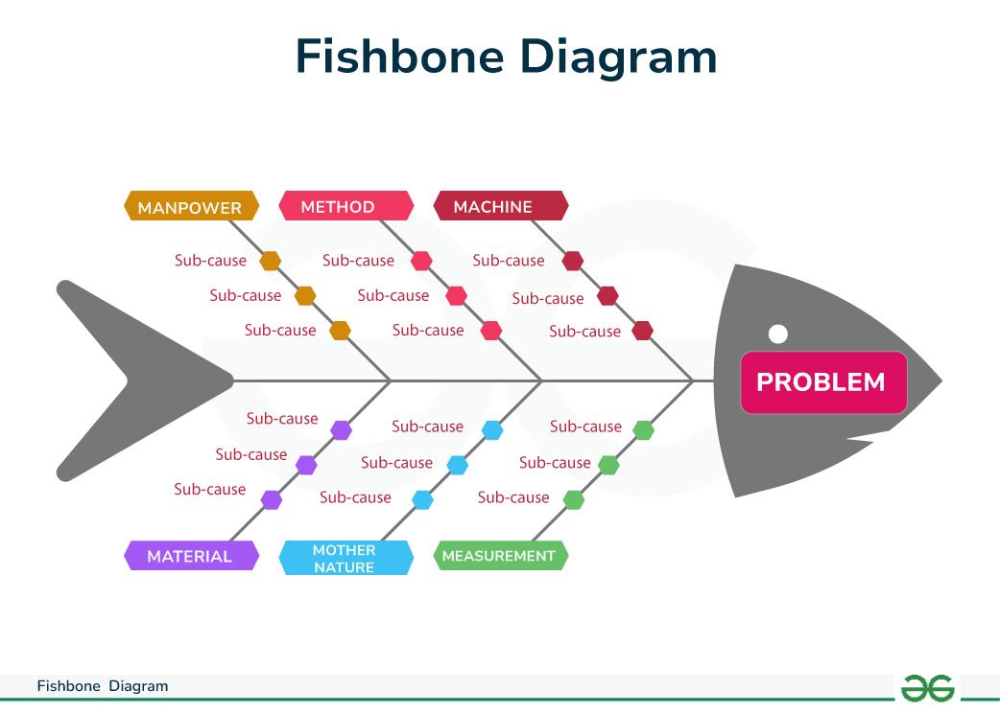

<u>RESTROSPEKTIVY</u>
- rektrospektivy jsou meetingy, kde tým hodnotí výsledky, dobré a špatné věci, navrhuje změny, hodnotí spolupráci.
  - retropektivy jsou přímo součástí agilních týmů, ale můžou být i v sekvenčním modelu.
  - retrospektivy jsou prováděny celým týmem.
  - ❗ **veškeré závěry jsou kvalitativní a ne kvantitativní(kvantitativní jsou analytické metody)**.

**retrospektiva má 5 kroků**

- **úvod**: vyřízení agendy, časového plánu retrospektivy, navození atmosféry.
- **shromáždění dat**: 
  - shromaždíme ***kvalitativní data*** z projektu př. seznam problémů na projektu a necháme vyjádřit členy týmu k tomuto seznamu.
  - můžeme prezentovat i kvantitativní data, i když to nené předmětem retrospektivy př. čísla o efektivitě, počet defektů, data vztahující se k projektu apod.
- **návrh zlepšení**: na základě dat navrhneme zlepšení např. na základě root case analýzy.
- **rozhodnutí o provedení akcí k zlepšení**: je vytvořen zlepšovací plán a stanoveny odpovědnosti za jednotlivé části.
  - ❗ je ***lepší implementovat méně kroků než všechny najednou*** => obtížně se to uhlídá.
- **uzavření retrospektivy**: dochází k retrospekci samotné retrospektivy, která zhodnocuje pozitivní přínos procesu retrospekce z hlediska navržených zlepšení.
  - protože retrospektiva je pravidelná událost, tak **chceme mít jistoto kvality** (nevyhazujeme čas zbytečně za meeting).
  - <span style="color:Teal">**výsledek retrospekce dokumentujeme.**</span>
  - ✅ v sekvenčním modelu musí být výsledky, nálezy, doporučený...komunikovány do dalších týmů organizace.
  - ✅ důležitou roli hrají testeři, kteří jsou součástí týmu = přináší vhled na kvalitu produktu a zároveň náměty na zlepšení.

<u>OTÁZKY K ZLEPŠOVÁNÍ TESTOVACÍHO PROCESU</u>

```txt
Jsi test manager a pracuješ na zlepšení testovacího procesu z hlediska efektivity a účinnosti. Na zlepšení jsi dostal i nějaký budget. 
Externista provedl posouzení celého procesu a dodal nálezy(krok 2 v IDEAL procesu)
```

- dalším krokem podle IDEA je stanovaní Test Process Improvment Plan  v podobě dokumentu

- ❔ **Jaký bude další krok v procesu zlepšení následujeme-li IDEA proces?**
- **odpověď A**: <u>správná odpověď</u>
- **odpověď B**: není správná = je to bod 4 IDEAL procesu a krok 3 byl přeskočen.
- **odpověď C**: není správná = inicializace procesu zlepšení již byla provedena.
- **odpověď D**: není správná = opět již bylo provedeno.

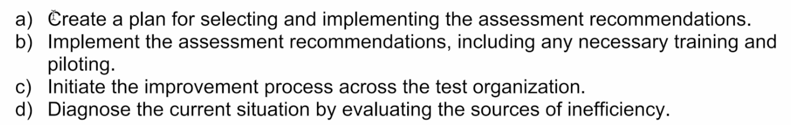

```txt
Jako test konzultant jsi zodpovědný za zlepšení testovacího procesu na kritickém projektu v malé bance. Proces se týká digitální transformace,  má trvat 2 roky a bude využit agilní přístup.
Protože TMMI model je v finančnictví populární, chce ho použít i banka.
```

- ❔ **Jak by jsi postupoval při zavedení TMMI modelu?**
- **odpověď A**: není správná = TMMI model může být použit jak na rganizačním level tak na projekt level.
- **odpověď B**: není správná = nevíme, zda již některý level nebyl použit. Chce to zhodnotit situaci a následně doporučit konkrétní level, který lze implementovat.
- **odpověď C**: <u>správná odpověď</u>
- **odpověď D**: není správná = SCRUM neříká jako zlepšit testovací proces.

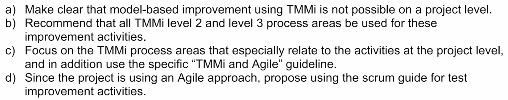

- ❔ **Jaké 2 z následujících oblastí mohou být zhodnoceny za pomocí retrospektivy?**
- **odpověď A**: <u>správná odpověď: "button customization" byla označeno jako low risk oblast, ale i když se jedná o oblast s nízkým rizikem, stejně ji musíme pokrýt testy.</u>
  - <u>oblasti nastavíme low priority.</u>
  - <u>pokud z této oblasti hlásí problémy uživatelé, tak je ale důležité se jí věnovat.</u>
- **odpověď B**: není správná = nejedná se o problém testingu.
- **odpověď C**: není správná = určuje detaily testovacích případů, ale to je příliš pozdě, protože testovací případy již byly vytvořeny = nemlžeme čekat až na retrospektivu.
  - mělo být uděláno na začátku releasu a ne až na konci.
- **odpověď D**: není správná = toto není předmětem retrospektivy.
  - mělo být provedeno např. v fázi monitoringu nebo kontroly a ne v retrospektivě.
- **odpověď E**: <u>správná odpověď: jak učinit testovací případy více efektivní, tak aby nevznikaly problémy reportované zákazníky.</u>

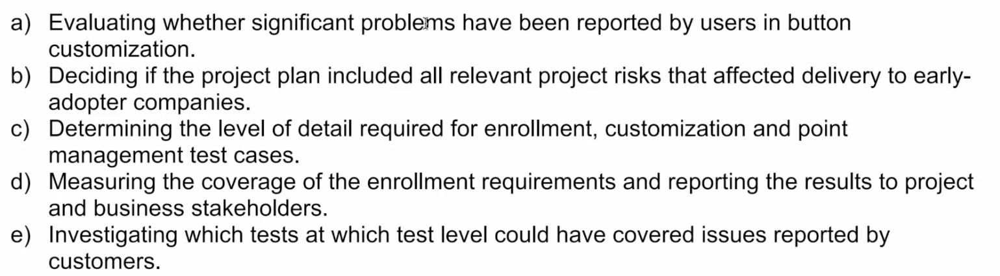

```txt
Jsi testerem v agilním týmu, který právě dokončil iteraci. Připravuješ retrospektivní schůzku spolu s ostatnímy členy týmu.
```

- ❔ **Která z následuích aktivit není součástí typické retrospektivy?**
- **odpověď A**: <u>správná odpověď: vše by mělo být pokryto v retrospektivě.</u>
- **odpověď B**: <u>správná odpověď: vše by mělo být pokryto v retrospektivě.</u>
- **odpověď C**: <u>správná odpověď: vše by mělo být pokryto v retrospektivě.</u>
- **odpověď D**: není správná = jedná se o zlepšování testovacího procesu, což není součástí retrospektivy.

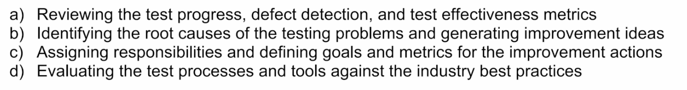

- ❔ **Jaký je účel IDEAL modelu?**
- **odpověď A**: není správná = spíše pro "smart goals"
- **odpověď B**: <u>správná odpověď</u>
- **odpověď C**: není správná = spíše pro risk based testing nebo jinou techniku vztaženou k riziku.
- **odpověď D**: není správná = spíše pro techniky vyhodnocující efektivitu.

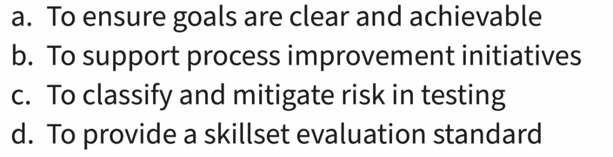

- ❔ **Co je charakteristické pro analytic-based test improvement model?**
- **odpověď A**: není správná = model-based charakteristika.
- **odpověď B**: není správná = nedefinuje best practices.
- **odpověď C**: není správná
- **odpověď D**: <u>správná odpověď</u>

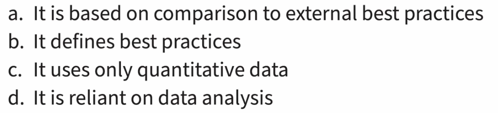

```txt
Na projektu poslední 2 měsíce probíhaly retrospektivy. 80% věcí k zlepšení se neustále opakují (jsou stejné) v každém výstupu z meetingu = nikdy jsme je neudělali, a proto se opakují.
```

- ❔ **Jaký krok v procesu chybí?**
- **odpověď A**: není správná
- **odpověď B**: není správná
- **odpověď C**: není správná
- **odpověď D**: <u>správná odpověď</u>

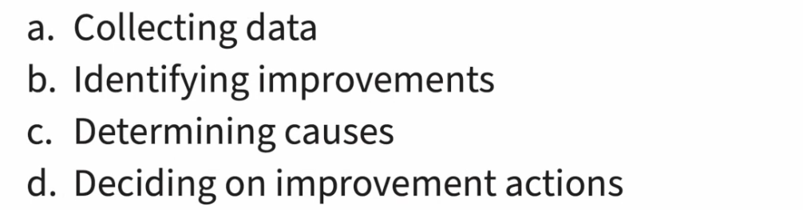

```txt
Jdeš na retrospektivní meeting, kde chceš vyzvednout téma, kdy vývojáři odmítají infomace k defektům stím, že v nich není dostatek informací, ačkoli informace byly poskytnuty.
```

- ❔ **Jaká data si vezmeš s sebou na meeting?**
- **odpověď A**: není správná
- **odpověď B**: <u>správná odpověď</u>
- **odpověď C**: není správná
- **odpověď D**: není správná

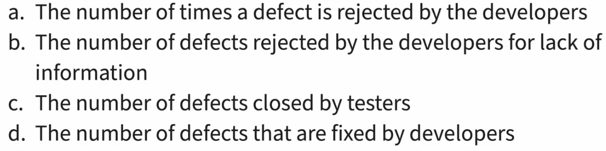

##### tools
### TEST TOOLS
#### <ul><li>ZAVEDENÍ NOVÉHO NÁSTROJE</li><li>TECHNICKÉ A BUSINESS ASPEKTY, KTERÉ MAJÍ VLIV NA ROZHODNUTÍ O ZAVEDNÍ NOVÉHO NÁSTROJE</li><li>NÁVRATNOST INVESTICE (ROI)</li><li>ŽIVOTNÍ CYKLUS NÁSTROJE</li><li>OTÁZKY K TEST TOOLS</li></ul>
- ✅ **máme 3 druhy testovacích nástrojů**:
  - [x] komerční testovací nástroje (kupujeme je)
  - [x] open source testovací nástroje (zdarma)
  - [x] uživatelské testovací nástroje (např. vlastní vyvinutý nástroj nebo přizpůsobený open source nástroj)
- za testovací nástroje i nově zavedené je odpovědný TM.

<u>ZAVEDENÍ NOVÉHO NÁSTROJE</u>

**GOOD PRACTICES při zavedení nového testovacího nástroje**
- 🔸 identifikujeme proces zlepšení při zavedení nového testovacího nástroje (př. podpora CI/CD)
- 🔸 tool musí podporovat současné technologie v společnosti.
- 🔸 tool musí být organizačně i technicky začlenitelný do SDLC (jaká je role nástroje v určté části life cyklu?).
- 🔸 pokud volíme komerční produkt, pak musíme posoudit zda má např. dobrou podporu, zda se jedná o prověřeného dodavatele nebo porovnat s open source nástroji.
- 🔸 **obecné good practises**:
  - spustit pilotní projekt, kde se ověří zda nástroj vyhovuje všem požadavkům a jak nástroj spolupracuje s zavedenými postupy.
  - definujeme postupy jak nástroj požívat.
  - vyškolíme a poskytujeme podporu teamu při používání nástroje.
  - **nástroj zavádíme postupně**
    - pokud máme např. 20 testerů rozdělených do 3 týmu, tak nový nástroj nejdříve začne používat 1 tým (klesne mu efektivnost, protože se teprve učí) a zbylé 2 týmy pokračují s dosavadním nástrojem (jedou naplno).
  - nastavíme postup jak získat informace o současném používání nástroje vyiužitelné pro další zlepšení.
  - určíme osobu, která bude "zodpovědná za nástroj" např. bude poskytovat odpovědi pro dotazy k nástroji.

<u>TECHNICKÉ A BUSINESS ASPEKTY, KTERÉ MAJÍ VLIV NA ROZHODNUTÍ O ZAVEDNÍ NOVÉHO NÁSTROJE</u>
- **regulace a bezpečnost**: pokud máme např. společnost podnikají v letectví, tak tato společnost potřebuje ISO certifikovaný a bezpečný SW ne open source.
- **finanční aspekt**: u open source nástrojů jsou počáteční náklady nižší(nulové) narozdíl od komerčních nástrojů.
- **požadavky stakeholderů**: nástroj je musí splňovat.
- **nástroj musí zapadat do portfolia současných nástrojů v společnosti a spolupracovat s nimi.**

<u>NÁVRATNOST INVESTICE (ROI)</u>
- ***vrátí se mi náklady investované do nového nástroje?***
  - <span style="color:DodgerBlue">**ROI je vyšší než náklady na pořízení nástroje a platí to i případě porovnání nástrojů mezi sebou (beru ten s vyšší ROI).**</span>
- **pro seniorní management je RIO podmínka.**
- pro procesní tým a podporu by byl nejlepší jeden nástroj na všechno.
- pro vedoucí projektů musí nástroj "něco zlepšovat" a to něco musí mít měřitelné hodnoty.
- pro uživatele nástroje musí být nástroj snadno použitelný.
- **vhodnost nástroje pro testovací tým posuzuje TM** i podle výsledku provedené ROI analýzy.
- můžeme provést **cost-benefit** analýzu, kde posoudíme jednorázové náklady a opakující se náklady na nástroj.

<u>jednorázové (opakující se) aktivity + náklady na nástroj</u>
- ✳️ **jednorázové náklady na**:
  - vybrání správného nástroje, který splňuje naše požadavky
  - nákup, adaptace a dodatečný vovoj nástroje pro počáteční použití
  - vytvoření manuálu pro použití
  - tréning na použití nástroje
  - integrace nástroje do celého ekosystému našich současných nástrojů
- ✳️ **opakující se náklady na**:
  - opakovaný nákup licencí nebo placení licenčních poplatků
  - náklady na údržbu nástroje
  - další náklay na nástroje př. (na updaty nástroje)
  - náklady na implementaci/přerozdělení nástroje mezi různá prostředí
- ✳️ **příležitostné náklady**:
  - náklady, které jsou vynaloženy v souvislosti s nástrojem (tréning, administrace, vývoj), ale které by mohli být vynaloženy na aktivity související s testování

**rizika při výběru nástroje vzhledem k ROI**
- neefektivní využití nástroje vzhledem k nedostatečné vyspělosti organizace (nikdo neumí nástroj využít efektivně).
- změny v politice prodejce nástroje.
- vyšší náklady na nástroj než se očekávalo nebo nižší benefit z nástroje než se očekávalo.

**benefity plynoucí z použití nástroje**
- redukce manuální práce (regesní testování)
- uspíšení testovacích kol
- ušetření nákladů ma test exekuci
- zvýšení pokrytí určitých částí testy
- redukce lidských chyb, rychlý přístup k výsledkům testů

<u>ŽIVOTNÍ CYKLUS NÁSTROJE</u>
- máme 4 životní období nástroje
- [x] **akvizice**: obsahuje rozhodnutí o vybrání nástroje, stanovení vlastníka nástoje(stanoví např. jak se bude nástroj jmenovat, kde se bude uložen...apod) = ***jednorázová aktivita***
- [x] **podpora a údržba nástroje**: vlastník nástroje nebo administrátor je zodpovědný za údržbu nástroje, zálohování, obnovu artefaktů souvisejích s nástrojem = ***opakovaná aktivita***
- [x] **vývoj**: rozvoj nástroje z důvodů změny politiky dodavatele nástroje, potřebám businessu apod.
- [x] **čas vyřazení nástroje**: př. nahrazení nástroje modernějším z mnoha důvodů př. končící podpora nástroje.

<u>VÝSTUPY NÁSTROJE</u>
- každý nástroj shromažďuje real-time data a redukuje úsilí potřebné k shromážďování těchto dat. 
- **typy výstupů dat**:
  - 🔵 **z test management nástrojů**: testovací plány, přehled exekují testů, test položky...apod.
    - zároveň nám poskytují tracebilitu .
  - 🔵 **z defect management nástrojů**: informace o defektech (status, severity, priority...apod).
  - 🔵 **z nástrojů statické analýzy**: např. metriky vztahující se k komplexivitě kodu.
  - 🔵 **z performance management tools**: informace o response time a selhání v případě zatížení.
  - 🔵 **z code coverage nástrojů**: informace o pokrytí kodu
- 🔵 <span style="color:DodgerBlue">**můžeme monitorovat i samotné nástroje**</span> např. kolik je zachyceno defektů bez použití nástroje a s použitím nástroje = **jak moc je nástro efektivní**.
- 🔵 **účinnost nástroje**: počet exekuovaných testů za jednotku času nebo jak dlouho trvá nástroji text exekuce všech testů.

<u>OTÁZKY K TEST TOOLS</u>

```txt
Jsi test manager pro nový produkt a máš za úkol vybrat nový test tool pro tento produkt.
```

- ❔ **Co není best practise pro výběr nového produktu?**
- **odpověď A**: není správná = vybrat updatovanou verzi samého toolu není dobrý přístup.
- **odpověď B**: <u>správná odpověď</u>
- **odpověď C**: <u>správná odpověď</u>
- **odpověď D**: <u>správná odpověď</u>

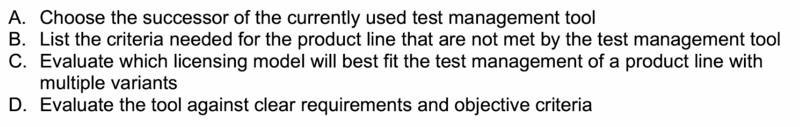

***

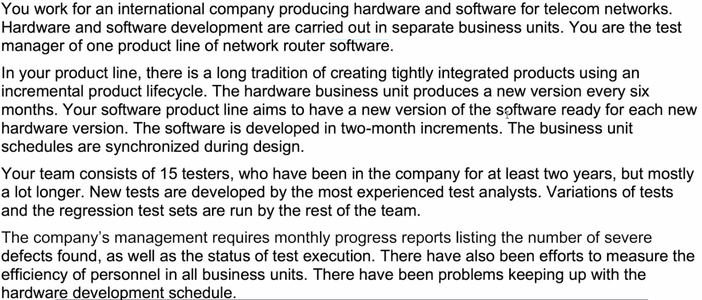

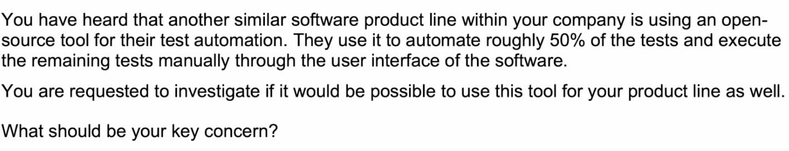

- ❔ **Co by mělo být klíčové pro vybrání nástroje?**
- **odpověď A**: není správná = většina open source nástrojů nemají dedikovaný support pouze fora, nějakou veřejnou dokumentaci, ale my potřebujeme oficiální support.
- **odpověď B**: není správná = nneí to klíčový požadavek na nástroj.
- **odpověď C**: <u>správná odpověď</u>
- **odpověď D**: není správná

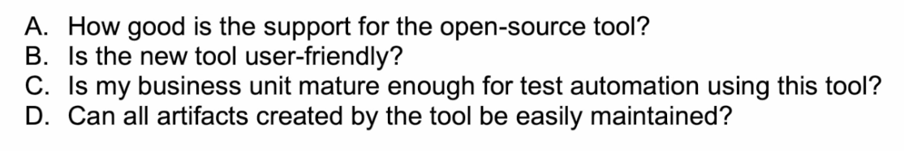

***

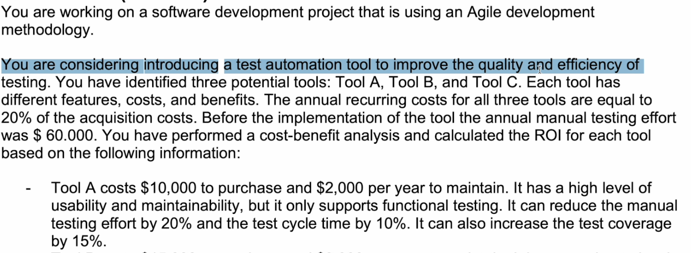

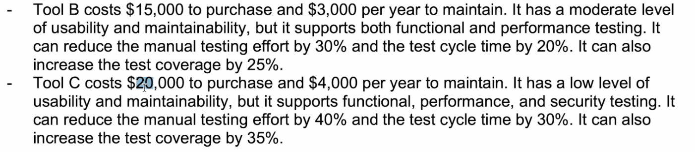

- ❔ **Na základě vypočtené ROI pro každý případ, jaký nástroj vybereme a proč?**
- **odpověď A**: není správná = můžeme vybrat nástroj A, protože je nejlevnější, nejlépe spravovatelný a má nejširší použití, ale C nástroj vychází lépe.
- **odpověď B**: není správná =  nástroj B podporuje funcionální a performance testování, ale C nástroj vychází lépe.
- **odpověď C**: <u>správná odpověď</u> = nástroj C navíc oproti B podporuje security testing, je nejlevnější = má nejvyšší ROI.
- **odpověď D**: není správná = každá z odpovědí A, B, C má pozitivní ROI.

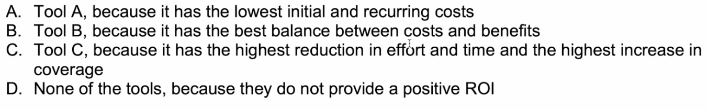

```txt
Pro testování produktu máme k dispozici uživatelský tool, který ale již nevyhovuje požadavkům a tak se rozhodneme použít open-source tool, který je používaný v společnosti, ale na jiném projektu.
```

- ❔ **Které z aktivit musíme provést <u>JAKO PRVNÍ</u>, když se rozhodneme opustit uživatelský tool a zavést open-source tool, aby se projevila přidaná hodnota nového nástroje co možná nejdříve?**
- **odpověď A**: není správná = uživatelský nástroj již nebude používán.
- **odpověď B**: <u>správná odpověď</u>
- **odpověď C**: není správná = viz. odpověď A
- **odpověď D**: není správná = některé testy, skripty již nepotřebuji a tak by to zabralo zybtečně příliš času.

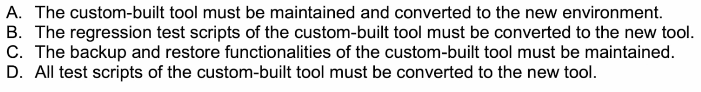

- ❔ **Který typ nástroje je nejlevnější (mluvíme o pořizovací ceně)?**
- **odpověď A**: není správná
- **odpověď B**: <u>správná odpověď</u>
- **odpověď C**: není správná
- **odpověď D**: není správná

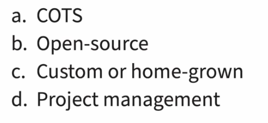

```txt
Manager se rozhodl, že všichni testeři v týmu se stanou automatizační testeři. Tým je schonější v analýze než po technické stránce, a proto má obavy z jejich adaptace.
```

- ❔ **Co může pomoci při výběru dodavatele nástroje?**
- **odpověď A**: není správná
- **odpověď B**: není správná
- **odpověď C**: <u>správná odpověď</u>
- **odpověď D**: není správná

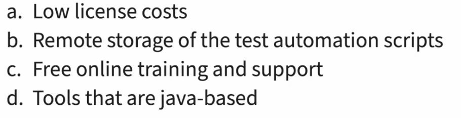

```txt
Testovací tým byl přiřazen na testování mobilní aplikace. Tým vyvíjí externí organizace, která provádí neustálé změny. Testovací tým nemá kapacitní možnosti vše otestovat ani zavést automatizaci.
Najme tedy externí firmu pro automatizované testy v nástroji, který testovací tým určí. Nyní potřebují dokončit testování včas a ejít se do budgetu.
```

- ❔ **Co bude hlavní obava?**
- **odpověď A**: <u>správná odpověď</u>
- **odpověď B**: není správná = testeři se nezapojí.
- **odpověď C**: není správná
- **odpověď D**: není správná

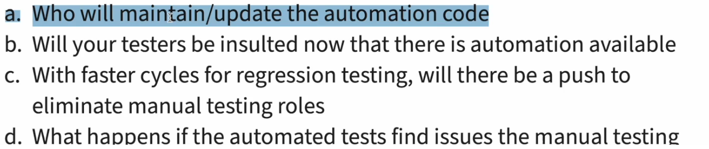

- ❔ **jak může code coverage pomoci testingu?**
- **odpověď A**: není správná = code coverage nesouvisí s požadavky, ale souvisí s pokrytí požadavků.
- **odpověď B**: není správná = např. 90% pokrytí kodem nic neříká o důležitosti segmentů.
- **odpověď C**: <u>správná odpověď</u>
- **odpověď D**: není správná = code coverage říká, jaké procento kodu bylo pokryto.

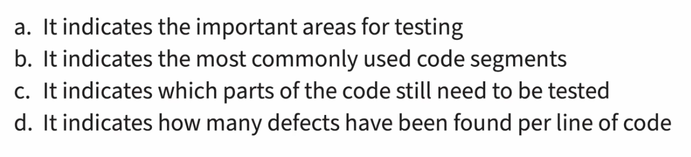

##### metriky
### TEST METRIKY
#### <ul><li>METRIKY PRO TEST MANAGEMENT</li><li>TEST REPORTING</li><li>OTÁZKY K TEST METRIKÁM</li></ul>
- "Co lze změřit, to je uděláno".
- test metriky nám dávají způsob, **jak zkontrolovat, zda byly splněny cíle testování**.
- <u>test metriky můžeme dělit do 3 kategorií:</u>
  - 🔸**projektové metriky**: př. počet exekuovaných testů, počet fail x passed testů
  - 🔸**produktové metriky**: př. stupeň kvality, který produkt splňuje.
  - 🔸**procesové metriky**: př. efektivita testování = procesní metriky se následně použijí do reportingu.

<u>METRIKY PRO TEST MANAGEMENT</u>
- metriky se stanovují v rámci test planningu a stanovují se pro test planning, test monitoring a control a test completation.
- během test planningu jsou stanoveny metriky pro vyhodnocení splnění testovacích cílů definovaných v test strategy.
- během test monitoringu jsou stanoveny metriky pro monitorováná progresu v testování.
- během test completation stanovujeme metriky pro měření exit kriterií/dosažení cílů z testovacích cílů = **výsledky z metrik jsou následně reportovány**.

**příklady metrik**

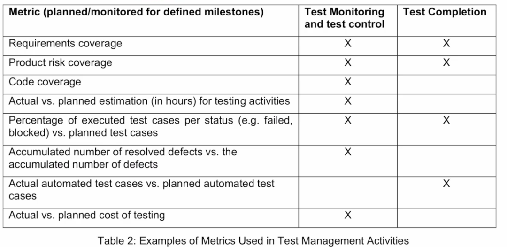

<u>TEST MONITORING, KONTROLA & TEST COMPLETATION</u>
- existuje vztah mezi test metrikami a monitoringem, kontrolou a completation.
- test monitoring je proces shromažďování dat a monitorování progresu v testování.
  - test control využívá data z test monitoringu pro zefektivnění a vetší účinnosti testování př.**můžeme přehodnotit prioritu testů**.
    - test completation shromažďuje data z všech testovacích aktivit (informace z testů, testovací data...apod).

<u>TEST REPORTING</u>
- ❗<span style="color:DarkCyan">**reportovací metriky poskytují informace pro management.**</span>
  - meteriky jsou prezentovány **jako snapshot v určitém čase(počet defektů vy systému nebo performance v %) nebo jako snapshot zobrazující vývoj v čase (trendy) př. porovnání výsledků mezi jednotlivými iteracemi**. 
- na high level úrovni (system testing, sys-integr. testing, akceptance testování) reportujeme metriky z user stories, use cases, product risks, requirements.
- na low level úrovni (component testing, component-integr. testing) reportujeme metriky z structure coverage.

**příklady metrik**

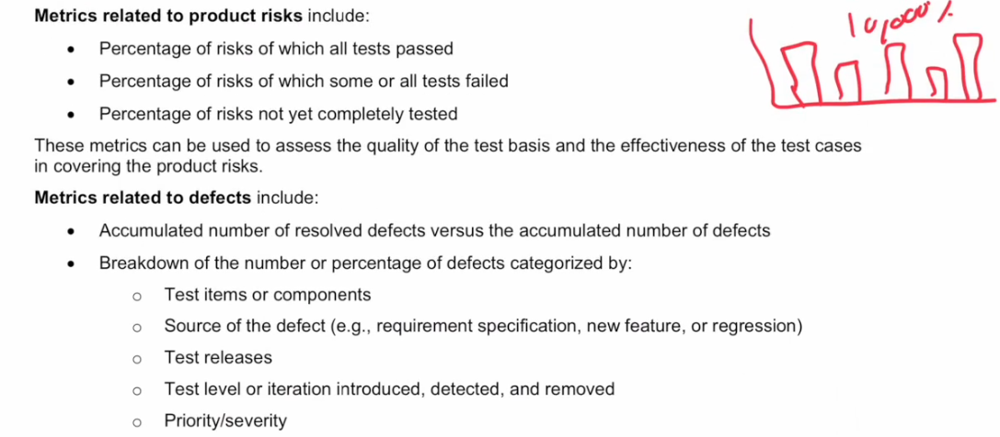

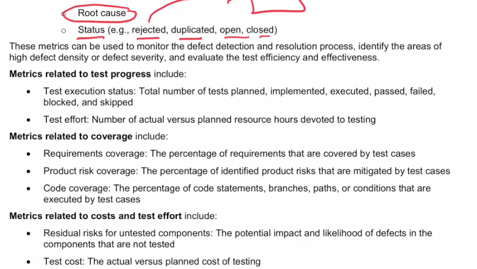

<u>OTÁZKY K TEST METRIKÁM</u>

```txt
Jako TM jsi požádán o testovací metriky.
```
- **nápověda jak zrychlit rozhodování:**
  - pro test planning není definována žádná metrika = A, D můžeme vyloučit (stejně není obsaženo v koncových dvojicích)
  - metrika 1 je spojena s monitoringem a kontrolingem (B) = 1B = správná odpověď je C
  - stejně tak 3C
- ❔ **Jakou skupinu metrik budeš reportovat pro jaký typ test management aktivity?**
- **odpověď A**: není správná
- **odpověď B**: není správná
- **odpověď C**: <u>správná odpověď</u>
- **odpověď D**: není správná

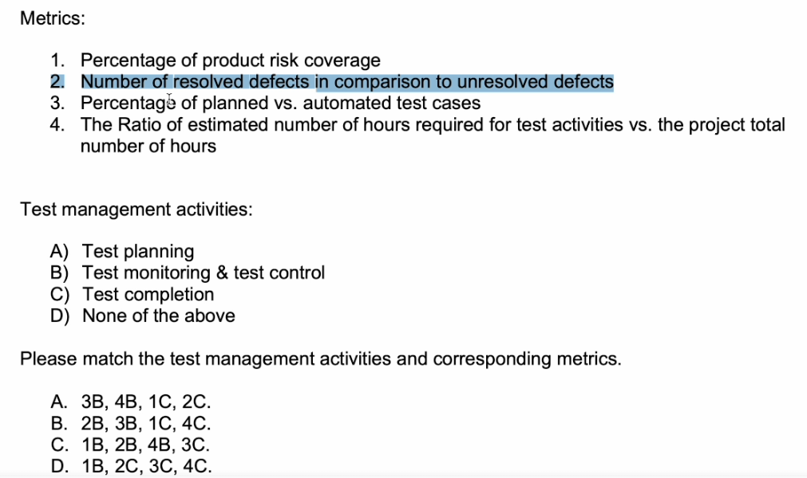

```txt
Jak vysvětlíš benefit použití test metrik business lidem?
```
- **jaké vysvětlení test metrik zvolíš?**
- **odpověď A**: <u>správná odpověď</u>
- **odpověď B**: není správná = resp. je o nepřímý benefit test metrik
- **odpověď C**: není správná = resp. je o nepřímý benefit test metrik
- **odpověď D**: není správná = resp. je o nepřímý benefit test metrik

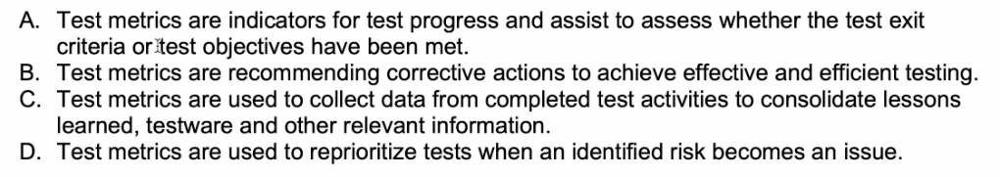

***

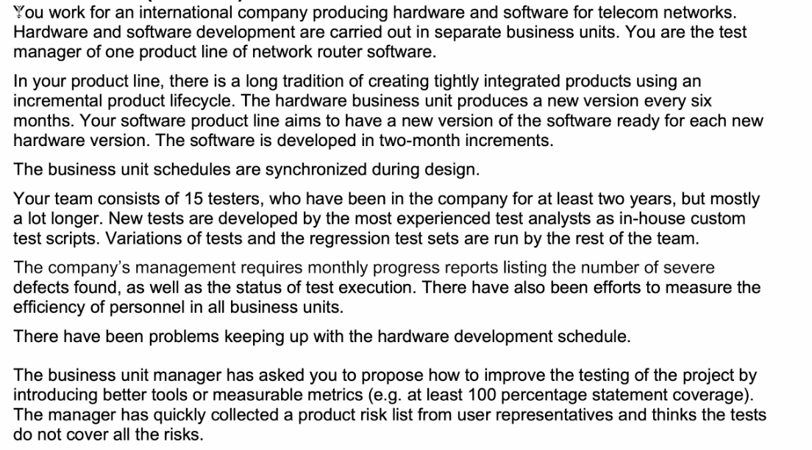

- **jakou možnost zvolíš?**
- **odpověď A**: není správná
- **odpověď B**: není správná
- **odpověď C**: není správná
- **odpověď D**: <u>správná odpověď</u>

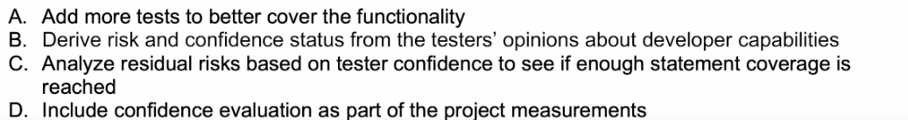

```txt
Vyber nejvhodnější metriky pro reportování výsledků testování na projektu, který se zabývá vývojem bankovních aplikací, má striktní bezpečnostní standarty a testovací tým je hierarchický, 
kdy testeři spolupracují s různými stakeholdery.
```
- **odpověď A**: <u>správná odpověď</u> = je jich nejvíce
- **odpověď B**: není správná
- **odpověď C**: není správná
- **odpověď D**: není správná

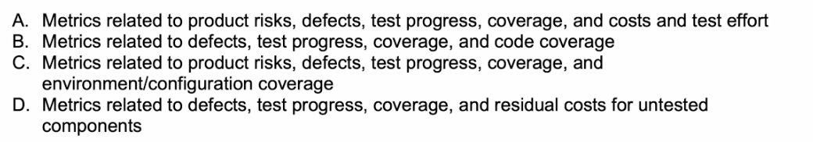

***

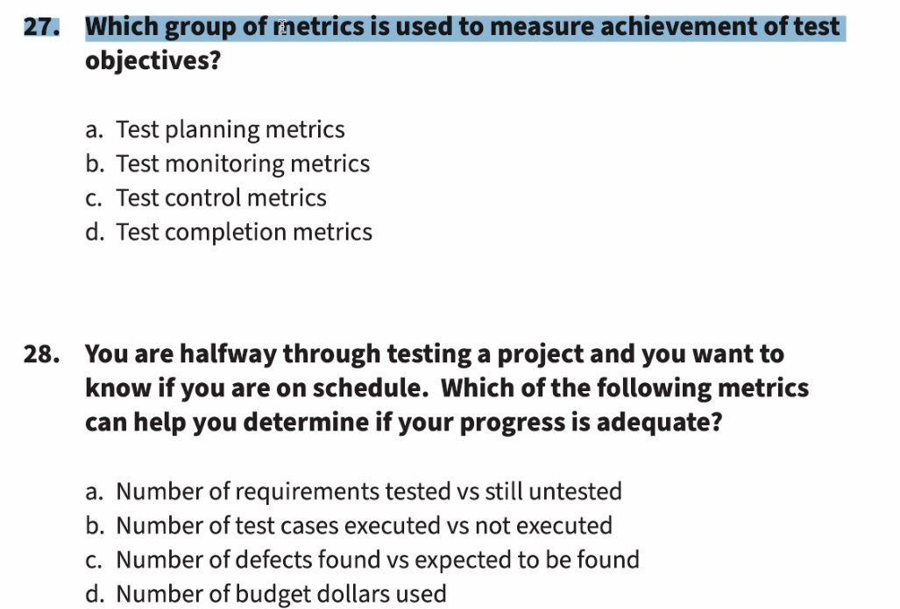

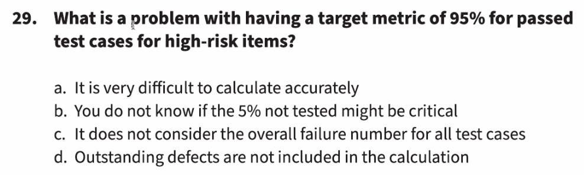


- **správné odpovědi**: 27D, 28B, 29B, 30B
- **nápověda k otázce 27**: neměříme progres. 
- **nápověda k otázce 28**: když mluvíme o test schedule, tak většinou uvažujeme o test execution.

##### odhady
### ODHADY NA TESTOVÁNÍ
#### <ul><li>FAKTORY OVLIVŇUJÍCÍ ODHADY TESTOVÁNÍ</li><li>ODHADOVACÍ TECHNIKY</li><li>EXTRAPOLACE</li><li>WIDEBAND DELPHI</li><li>3-BODOVÝ ODHAD</li><li>VÝBĚR TECHNIKY PRO ODHAD</li><li>OTÁZKY</li></ul>
- <span style="color:Sienna">**hlavní odhady v TM se týkají :**</span>
  - [x] **úspěch**: měříme např. kolik hodin trvalo provedení testování nebo kolik bylo potřeba "story points".
    - doba trvání testování je ale jiná = započítává se i příprava k testování (instalace diverů, nastavení prostředí...).
  - [x] **čas**: čas potřebný k dokončení projektu
  - [x] **náklady**: celkový budget na testování.
- ✳️ testing je občas považován za subproject v projektu.
- pro odhady v testování potřebujeme identifikovat test levels, test aktivities a test tasks.
  - následně vše rozdělíme mezi 2 hlavní test aktivity( test planning a test exekuci).
- vstupuje zde do hry **TIME-COST-QUALITY TRIANGL** = <span style="color:Sienna">**každá veličina ovlivní ostatní 2 veličiny (jinak to není možné).**</span>
- <u>máme 3 scénáře:</u>
- **první**
  - pokud bude požadováno dokončit testování místo plánovaných 3 měsíců za 2 měsíce, pak:
    - musejí vzrůst náklady (další pracovníci, více času...apod).
    - pokud manager řekne, že náklady se nesmi zvýšit, pak  musí poklesnout kvalita dodávky (omezené testování).
- **druhý**
  - pokud chceme snížit náklady, tak vzroste čas a klesne qualita.
- **třetí**
  - pokud chceme zvýšit kvalitu, tak nám vroste čas nebo náklady nebo obojí.
- ❗pokud mohu změnit jednu veličinu např. snížení času bez zvýšení nákladů = **PAK ODHADY BYLY CHYBNÉ**.

<div class="row">
  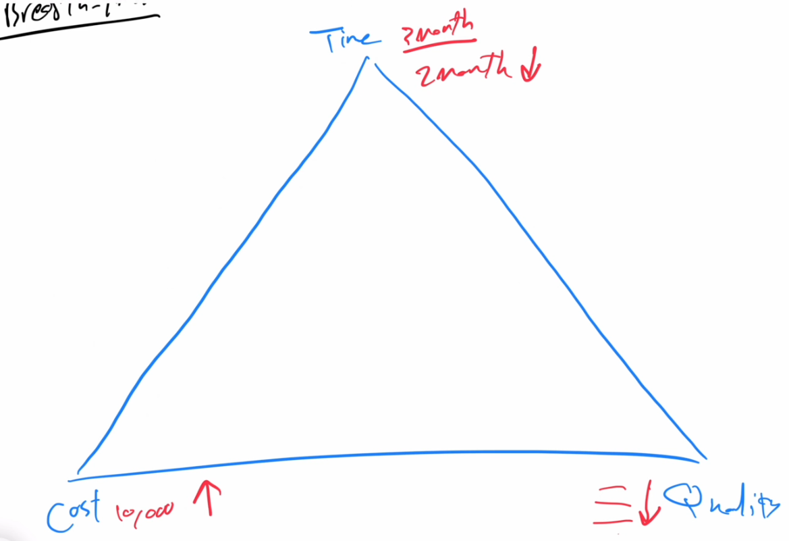
  
</div>

<u>FAKTORY OVLIVŇUJÍCÍ ODHADY TESTOVÁNÍ</u>
- odhady představí predikci množství práce vztažené k projektu, iteraci nebo releasu pro splnění test objectives.

**produktové faktory**
- 🔸 qualita test bases (požadavky, user stories...) = **čím vyšší kvalita, tím méně testování**.
- 🔸 velikost produktu
- 🔸 komplexnost produktu
- 🔸 požadavky na kvalitu testování (př. security testování)

**development proces**
- 🔸 stabilita a vyspělost vývojových procesů
- 🔸 development model (agilní model/hybridní model)
- 🔸 materiální faktory: dostupnost automatizace, testovacích prostředí aj.

**lidé**
- 🔸 spokojenost lidé (dostatek volna, očekávané benefity)
- 🔸 zkušenost a dovednosti lidí

**výsledky z testů (test results)**
- činnost následující po testování:
  - 🔸 počet a závažnost defektů nalezených po testovacím procesu.
  - 🔸 objem práce, které je potřeba udělat opakovaně (retesting).

**test kontext**
- 🔸 např. testování je rozděleno mezi více týmů a může být i mezi více zemí (odlišné časové zóny GMT).
- 🔸 typ práce (na pracovišti nebo virtuálně).

<u>ODHADOVACÍ TECHNIKY</u>
- použivají se pro odhadnutí testerské práce na projektech.
  - pro velké projekty je dobré je <span style="color:Sienna">**rozdělit na menší části a tyto menší části pak odhadnout**</span>.

<u>ODHADY NA ZÁKLADĚ POMĚRŮ</u>
- technika je závislá ne měřitelných metrikách = **metric-based technika**.
  - ***není závislá na zkušenostech.***
- techniky založené na poměrech: odhady vychází z metrik podobných/minulých projektů nastavené "dobré standarty".
  - ✅ př. máme nový projekt, který je podobný a 2x tak velký jako minulý projekt = odhad bude 2x větší než u minulého projektu.
  - ✅ příklad poměru 3:2 (např. 3 hodiny vývoje vyžadují 2 hodiny testování)
    - poměr může být uplatněn na jakoukoli metriku např. automatizaci
      - 🔵 v minulém projektu trvalo 100 user stories 2 hodiny automatizace
      - 🔵 v novém projektu máme 200 use strories a bude to trvat 4 hodiny.

<u>EXTRAPOLACE</u>
- **extrapolace** = máme nějaký vývoj v historii a na základě této historie může "extrapolovat" podobný vývoj v budoucnosti.

**příklad extrapolace s pozitivním, neutrálním a negaivním vývojem**

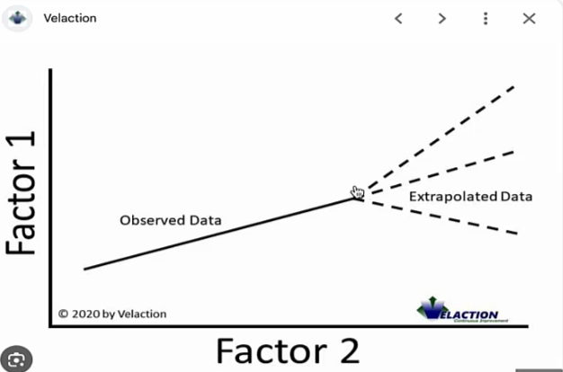
- pracujeme pouze s daty z současného projektu = **data potřeba sbírat co možná nejdříve/na začátku projektu.**
- na základě těchto dat extrapolujeme vývoj do budoucna.
- vhodné pro iterativní projekty = **data z minulé iterace se použijí pro extrapolaci dat pro následující nebo několik následujících iterací**.

<u>WIDEBAND DELPHI</u>
- je to iterativní, expert-based technika.
- **techniku provádíme opakovaně/iterativně resp. v iteracích** a je založena **na zkušenostech** např. testovacího týmu.
- př. testerský tým udělá odhad a pokud tento odhad není v stanovených mezích/hranicích př. 2 - 10 hodin (odhad je 30 hodin), pak se odhad diskutuje a dělá se nový odhad na základě diskuze a připomínek.
  - odhad tedy není zatížen osobní zkušeností, ale je korigován celým týmem (pokud je potřeba).
  - jedna z variant Wideband Delphi je <span style="color:Sienna">**Planing Poker a ten je používán v agilních projektech.**</span>
    - v PP používáme karty, které reprezentují velikost odhadu.

<u>3-BODOVÝ ODHAD</u>
- je to expert-based technika.
- **experti udělají 3 odhady**: optimistický = a, s největší pravděpodobností = m, pesimistický = b.
- ✳️ konečný odhad je **ARITMETICKÝ PRŮMĚR**: e = `(a + 4*m + b / 6)`.
- **výhoda** této techniky je, že <span style="color:Sienna">**můžeme spočítat chybu odhadu(standart deviation)**</span> jako: `sd = (b - a) / 6`.
- **příklad**: odhad hodin na testing je a = 6, b = 9, c = 18.
  - odhad e je `(6 + 4*9 + 18) / 6 = 10 hodin`.
  - chyba odhadu je: `(18 - 6) / 6 = 2 hodiny`.
  - konečný odhad je tedy 10 +- 2 hodiny.

<u>VÝBĚR TECHNIKY PRO ODHAD</u>
- ❗hodně test manageů si pod pojmem odhady na testování představí **pouze exekuci testů**, což není správné.
  - odhady jsou ovlivněny kvalitou vstup. kvalitou sw, zkušenostmi testerů, znalostí testovaného produktu.
  - odhady jsou **poskytovány pro určitý bod v čase** (následně se třeba může změnit scope požadavku).
- <u>máme 2 kategorie technik odhadům které si můžeme vybrat:</u>
  - **expert based**: založeny na zkušenostech
  - **metric-based**: založeny na datech
- <u>máme 5 faktorů, které nám ovlivní výběr odhadovací techniky</u>
  - 🔵 **chyba odhadu**: některé techniky poskytují možnost spočítat chybu odhadu např. technika 3-BODOVÉHO ODHADU.
  - 🔵 **dostupnost dat**: některé techniky vyžadují historická data z předchozích nebo podobných projektů př. technika EXTRAPOLACE.
  - 🔵 **dostupnost expertů**: některé techniky vyžadují dostupnost expertů př. technika WIDEBAND DELPHI.
  - 🔵 **znalost modelování**: některé techniky vyžadují použití matematických modelů pro kalkulaci odhadů př. technika 3-BODOVÉHO ODHADU nebo technika EXTRAPOLACE.
  - 🔵 **dostatek času**: někeré techniky vyžadují dostatek času a úsilí k provedení př. Planing Poker je snadná a rychlá technika, ale EXTRAPOLACE již vyžaduje větší úsilí i čas.
- **obecně platí**: 
  - <span style="color:Sienna">**když mám málo komplexní projekt, pak použiji metric-based techniku, ale pro komplexní projekt použiji expert-based techniku.**</span>
  - <span style="color:Sienna">**v sekvenčním modelu použiji WIDEBAND DELPHI techniku, ale v agilním projektu spíše Planning Poker techniku.**</span>

<u>OTÁZKY</u>

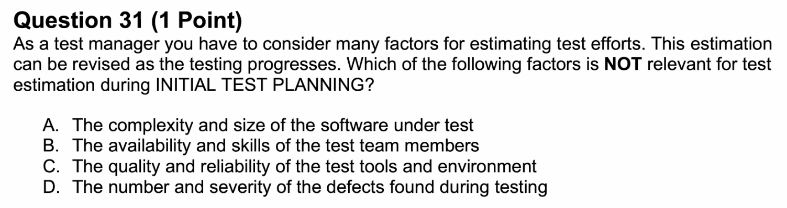

- **odpověď A**: <u>správná odpověď</u>
- **odpověď B**: <u>správná odpověď</u>
- **odpověď C**: <u>správná odpověď</u>
- **odpověď D**: není správná - zatím neproběhal aexekuce testů (jsme v test planning fázi)

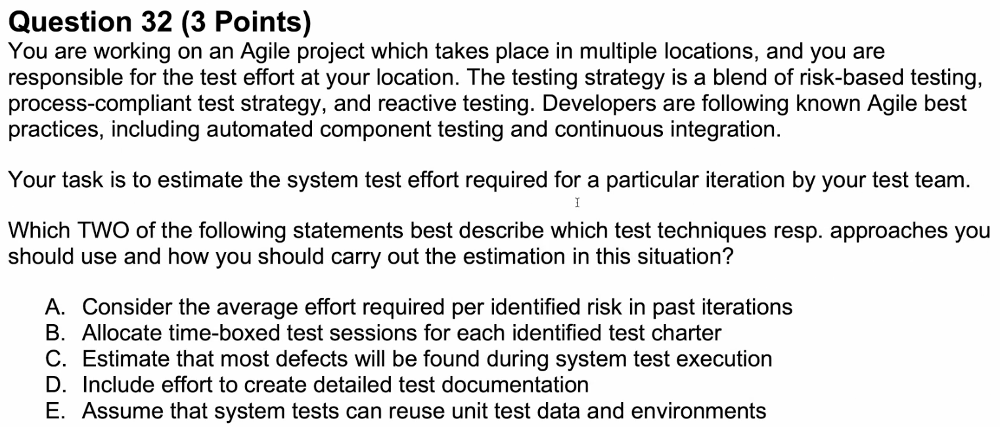

- **odpověď A**: <u>správná odpověď</u>
- **odpověď B**: <u>správná odpověď</u>
- **odpověď C**: není správná - v agilním projektu je většina chyb odhalena v unit a integračním testování, i proto že používáme SHIFT-LEFT strategii
- **odpověď D**: není správná - v agilním projektu není potřeba detailní dokumentace, ale spíše stručná dokumnetace.
- **odpověď E**: není správná - v systémovém testování většinou používáme specifická data pro různá prostředí.

**SHIFT-LEFT strategie**

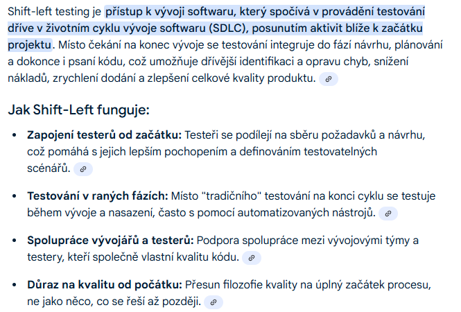

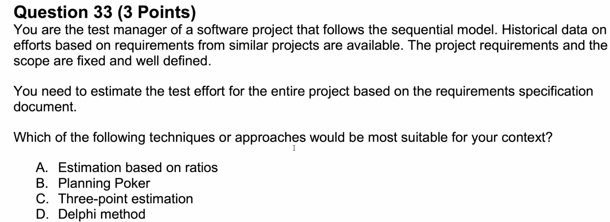

- použijeme metric-based techniku, protože máme k dipozici data z minulých projektů.

- **odpověď A**: <u>správná odpověď</u>
- **odpověď B**: není správná
- **odpověď C**: není správná
- **odpověď D**: není správná

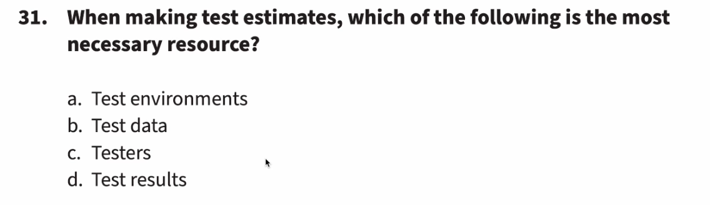

- **odpověd C je správná** (je rozdíl zda mám 1 testera nebo 10 testerů + je důležité jaké mají zkušenosti a co umí.)

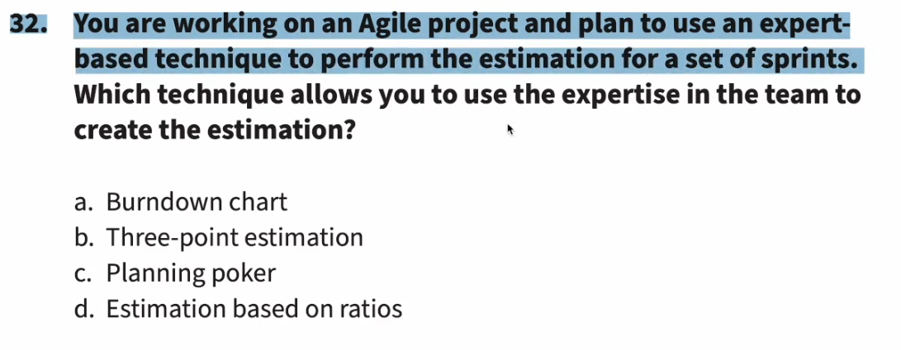

- **odpověd C je správná** (v agilním projektu použijeme Planning Poker techniku nejčastěji).

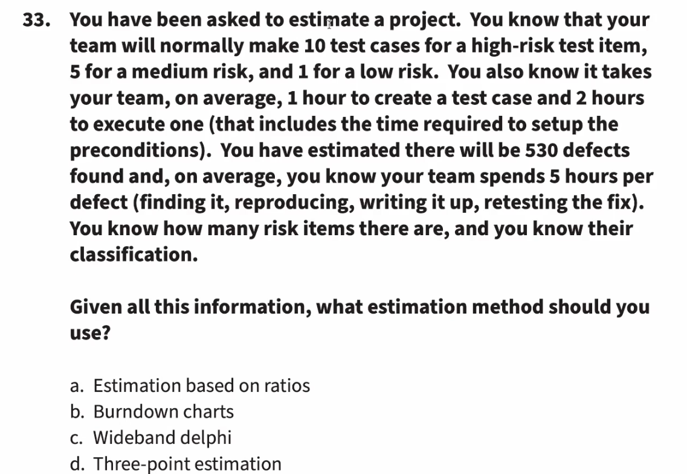

- použijeme metric-based techniku.
- **odpověď A je správná**.

##### defect
### DEFECT MANAGEMENT
#### <ul><li></li><li></li><li></li><li></li><li></li><li></li><li></li><li></li><li></li><li></li><li></li><li></li></ul>
